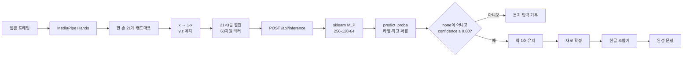

# 최종 발표 AI 모델 파트 분석 및 질문 대비

> 담당 파트: **AI 모델 구상 및 구현**  
> 분석 기준: 현재 저장소의 실제 코드, 운영 모델 파일, 모델 카드와 평가 결과  
> 핵심 원칙: 운영 모델과 연구 모델을 구분하고, 저장소에서 입증되지 않는 내용은 `확인 필요`로 표시한다.

---

## 1. AI 모델 개발 흐름 요약

### 전체 변화

```text
초기 구상
연속적인 교통 단어 수어 인식
MediaPipe Holistic → 45프레임 × 201차원 → BiLSTM → 단어 1개
                         ↓
연구 코드 구현
26개 단어 수집·학습·평가·4초 캡처 추론 코드 작성
                         ↓
운영 범위 재정의
일반 단어 수어가 아니라 정적 한국 수어 지문자로 질문 작성
                         ↓
최종 운영
MediaPipe Hands → 21×3=63차원 → sklearn MLP → 31개 자모 또는 none
→ 체류시간 입력 → 한글 조합
```

### 초기 BiLSTM 방향

초기 연구 모델은 사용자의 한 번의 손 모양이 아니라 **여러 프레임 동안 진행되는 동작의 순서**를 보고 교통 관련 단어 하나를 분류하려는 모델이었다. 같은 손 모양이라도 손이 이동하는 방향과 동작 순서에 따라 단어 의미가 달라질 수 있으므로, 시간 흐름을 처리할 수 있는 LSTM을 양방향으로 구성한 BiLSTM을 선택했다.

코드에서 확인되는 인식 대상은 다음 26개다.

`가다`, `감사`, `건너다`, `고장`, `공항`, `기차`, `내리다`, `도움`, `맞다`, `매표소`, `버스`, `시간`, `어디`, `엘리베이터`, `여기`, `역`, `오른쪽`, `왼쪽`, `잃어버리다`, `정류장`, `지하철`, `찾다`, `카드`, `타다`, `택시`, `화장실`

### 최종 MLP 방향

최종 서비스는 교통 관련 단어를 바로 분류하는 대신, 사용자가 **정적 지문자를 한 글자씩 표현해 자유 문장을 작성하는 방식**으로 범위가 바뀌었다. 정적 지문자는 여러 프레임의 동작 순서보다 한 시점의 손가락 배치가 핵심이므로, 63차원 고정 벡터를 빠르게 분류하는 MLP가 최종 문제 정의에 더 적합했다.

### 발표에서 반드시 지켜야 할 표현

- “BiLSTM 모델이 완전히 실패했다”라고 단정하면 안 된다.
- 정확한 표현은 **“BiLSTM 연구 코드는 구현됐지만 운영 모델·데이터·신뢰할 수 있는 최종 평가 자료가 현재 저장소에 보존돼 있지 않고, 최종 서비스 범위와도 달라 운영 경로에서 분리됐다”**이다.
- “MLP가 일반 수어 문장을 번역한다”라고 말하면 안 된다.
- 최종 MLP는 **정적 지문자 31개와 중립 자세 `none`을 분류**한다.

---

## 2. BiLSTM 구현 내용

### 관련 폴더

`research/word_bilstm/`은 현재 운영 경로에서 분리된 단어 수어 연구 보관소다.

| 파일 | 역할 |
|---|---|
| `research/word_bilstm/collect_word_data.py` | MediaPipe Holistic으로 4초간 Pose·양손 특징을 수집하고 45프레임으로 균등 샘플링 |
| `research/word_bilstm/ai/model_bilstm.py` | PyTorch `BiLSTMClassifier` 모델 정의 |
| `research/word_bilstm/ai/dataset_dynamic.py` | `<수집자>/<단어>/*.npy` 탐색, 길이 조정, 패딩, 정규화와 증강 |
| `research/word_bilstm/ai/preprocess.py` | 학습 평균·표준편차 계산, 시간축·공간 증강 |
| `research/word_bilstm/ai/train_bilstm.py` | 학습·검증 분할, CrossEntropy 학습, early stopping, 모델 저장 |
| `research/word_bilstm/realtime_word_inference.py` | Space를 누른 뒤 4초 캡처하여 단어 하나 추론 |
| `research/word_bilstm/evaluate.py` | 분류 리포트와 단어별 오답 출력 |
| `research/word_bilstm/README.md` | 연구 모델 데이터 형식과 실행 절차 설명 |

### 입력 데이터 형태

한 샘플은 `(45, 201)` `float32` 배열이다.

```text
45 = 한 동작을 표현하는 시간 순서 프레임 수
201 = 한 프레임에서 추출한 Pose와 양손 특징 수
```

201차원 구성:

| 구간 | 구성 | 차원 |
|---|---|---:|
| `[0:75]` | Pose 앞 25개 랜드마크 × `(x-cx, y-cy, visibility)` | 75 |
| `[75:138]` | 왼손 21개 랜드마크 × `(x-cx, y-cy, 1.0)` | 63 |
| `[138:201]` | 오른손 21개 랜드마크 × `(x-cx, y-cy, 1.0)` | 63 |
| 합계 | 25×3 + 21×3 + 21×3 | 201 |

중요한 사실:

- BiLSTM의 손 특징 세 번째 값은 `z`가 아니라 상수 `1.0`이다.
- Pose는 `x`, `y`, `visibility`를 사용한다.
- 왼쪽·오른쪽 어깨의 중점을 `(cx, cy)` 기준점으로 삼아 각 좌표에서 뺀다.
- Pose가 검출되지 않으면 화면 중앙 `(0.5, 0.5)`을 기준점으로 사용한다.
- 특정 Pose 또는 손이 검출되지 않으면 해당 영역은 0으로 남는다.
- 영상은 좌우 반전한 뒤 MediaPipe Holistic으로 처리한다.

### 4초 영상을 45프레임으로 만드는 방식

1. 사용자가 Space를 누른다.
2. 데이터 수집 시에는 3초 카운트다운 후 4초 동안 가능한 만큼 프레임을 수집한다.
3. 최소 30프레임보다 적으면 저장하지 않는다.
4. 수집된 전체 프레임에서 `np.linspace`로 45개 위치를 균등 선택한다.
5. 결과를 `(45,201)` `.npy`로 저장한다.

이 방식은 카메라 FPS가 달라도 항상 같은 입력 크기를 만든다는 장점이 있다. 반면 실제 동작이 시작·종료되는 위치를 자동 검출하지 않고 4초 전체를 고정 사용한다.

### BiLSTM 모델 구조

기본 학습 인자는 다음과 같다.

- 입력 크기: 201
- 최대 시퀀스 길이: 45
- hidden size: 128
- LSTM layer: 2개
- bidirectional: `True`
- dropout: 0.5
- batch size: 32
- epoch: 최대 50
- optimizer: Adam, 학습률 `0.001`
- loss: CrossEntropyLoss
- validation split: 20%
- early stopping patience: 6

구조:

```text
입력 (B, 45, 201)
  → 2층 양방향 LSTM, 방향별 hidden 128
  → 마지막 유효 timestep의 출력 256차원
  → Dropout(0.5)
  → Linear(256 → 128)
  → ReLU
  → Dropout(0.5)
  → Linear(128 → 단어 클래스 수)
  → Softmax는 추론 시 적용
```

`B`는 한 번에 처리하는 샘플 수, `45`는 시간, `201`은 프레임별 특징 수다.

### 단어 분류 방식

모델은 45개 프레임의 순서를 읽고 각 단어 클래스에 대한 점수인 logits를 출력한다. 학습에서는 정답 단어와 CrossEntropyLoss를 계산한다. 추론에서는 softmax로 클래스별 확률을 만들고 가장 높은 단어를 선택한다. 연구 실시간 추론 코드에서는 최고 확률이 0.5 이상일 때만 문장 목록에 단어를 추가한다.

### 전처리와 증강

- 학습 데이터에서 feature별 평균과 표준편차를 계산한다.
- 입력을 `(값-평균)/(표준편차+1e-8)`로 정규화한다.
- 시간축을 약 ±10% 늘리거나 압축한다.
- x·y 전체 이동 최대 0.03, 크기 변화 ±5%, 좌표 노이즈 0.003을 적용한다.
- 길이가 45보다 길면 중앙을 잘라내고 짧으면 뒤에 0을 패딩한다.
- `pack_padded_sequence`로 실제 길이를 LSTM에 전달한다.

### 저장하도록 구현된 산출물

- `dynamic_gesture_model.pt`: PyTorch 가중치
- `label_encoder_dynamic.pkl`: 숫자와 단어 라벨 변환기
- `norm_stats.pkl`: 학습 평균과 표준편차
- `model_config.pkl`: 입력 크기·hidden·layer·class·길이 설정

현재 상태:

- 위 산출물과 `word_data/`는 `.gitignore` 대상이며 현재 프로젝트 폴더에는 없다.
- 따라서 현재 저장소만으로 BiLSTM 모델을 바로 실행할 수 없다.
- 실제 샘플 수, 실제 수집자 수, 최고 validation accuracy, 외부 사용자 정확도는 **확인 필요**다.
- `ai/ai_hub/train_aihub.py`의 설명에는 팀 데이터 약 2,661개·27단어, AI Hub 약 205개·8단어라고 적혀 있지만 현재 경로·26단어 연구 README와 일치하지 않고 원본 데이터도 없어 최종 수치로 발표하면 안 된다.

### 최종 운영 연결 여부

연결되지 않았다.

- React는 MediaPipe Hands의 63차원만 `/api/inference`로 전송한다.
- FastAPI는 `app/ai/models/gesture_model.pkl`의 sklearn MLP만 로드한다.
- `app/`, `src/`에서 `research/word_bilstm`을 import하지 않는다.
- BiLSTM은 `research/` 아래에서 독립 실행하는 Python 연구 코드다.

발표 문장:

> “BiLSTM은 26개 교통 단어를 대상으로 데이터 수집부터 학습과 추론까지 연구 코드로 구현했습니다. 하지만 최종 운영 백엔드와 웹에는 연결하지 않고 연구 경로로 분리했으며, 현재 서비스는 검증된 지문자 MLP만 사용합니다.”

---

## 3. BiLSTM이 안정화되지 못한 이유

### 먼저 구분해야 할 사실

저장소에는 “BiLSTM이 특정 정확도로 실패했다”는 최종 실험 보고서가 없다. 따라서 아래 내용은 두 종류로 구분한다.

- **확정 사실**: 데이터·모델 산출물·최종 평가가 없고 운영 코드에 연결되지 않았다.
- **코드 기반 위험 분석**: 구현 구조상 일반화와 키오스크 사용성에 영향을 줄 수 있는 요소다. 실제 영향 크기는 확인 필요다.

### 원인 1: 실제 데이터 규모와 수집자 다양성을 검증할 수 없음

- **원인:** 단어별 샘플 수와 수집자 수를 현재 저장소에서 확인할 수 없다.
- **코드 또는 구조 근거:** 데이터 경로는 `word_data/<수집자>/<단어>/*.npy`지만 `word_data/` 전체가 Git 제외됐고 현재 폴더에 없다. README는 단어당 100개와 여러 수집자를 “권장”할 뿐 달성 결과를 기록하지 않는다.
- **실제 영향:** 모델이 특정 사람의 손 크기·속도·표현 습관을 외우면 새로운 사용자에게 성능이 떨어질 수 있다.
- **발표에서 말할 수 있는 문장:** “수집 구조는 여러 사용자를 구분하도록 설계했지만, 현재 보존 자료로는 실제 수집자 수와 단어별 분포를 입증할 수 없어 운영 채택 근거가 부족했습니다.”
- **질문이 들어왔을 때 답변:** “정확한 수집자 수는 확인 필요입니다. 그래서 BiLSTM 성능을 일반화해 주장하지 않고 연구 모델로만 설명합니다.”

### 원인 2: 샘플 단위 무작위 분할로 사용자 편향 가능

- **원인:** 같은 수집자의 샘플이 train과 validation 양쪽에 들어갈 수 있다.
- **코드 또는 구조 근거:** `train_test_split(paths, labels, stratify=labels, random_state=42)`를 사용하며 speaker 기준 그룹 분할을 하지 않는다.
- **실제 영향:** validation 정확도가 높아도 같은 사람의 특징을 본 결과일 수 있어 새로운 사용자 성능을 과대평가할 가능성이 있다.
- **발표에서 말할 수 있는 문장:** “단어 비율은 유지했지만 수집자 독립 분할이 아니어서 사용자 일반화 검증에는 한계가 있었습니다.”
- **질문이 들어왔을 때 답변:** “향후에는 GroupKFold나 수집자 단위 holdout으로 한 사람의 데이터를 한쪽 세트에만 배치해야 합니다.”

### 원인 3: 저장된 평가 코드가 독립 validation만 평가하지 않음

- **원인:** `evaluate.py`가 train/validation 분할 변수를 만들지만 실제로는 전체 `paths`를 다시 데이터셋으로 만들어 평가한다.
- **코드 또는 구조 근거:** `train_p`, `val_p`를 계산한 뒤 `DynamicSignDataset(paths=paths, labels=labels)`를 사용한다.
- **실제 영향:** 이 스크립트에서 나온 정확도가 있었다면 학습 데이터를 포함한 수치여서 운영 성능 근거로 사용하기 어렵다.
- **발표에서 말할 수 있는 문장:** “기존 평가 코드는 전체 데이터 평가여서 독립 검증 지표로 사용하지 않았습니다.”
- **질문이 들어왔을 때 답변:** “평가 코드를 validation-only와 사용자 독립 test set으로 수정하고 혼동행렬을 다시 산출해야 합니다.”

### 원인 4: 고정 4초 캡처와 동작 경계 차이

- **원인:** 사람마다 동작 시작·종료와 속도가 다르지만 입력은 Space 이후 고정 4초다.
- **코드 또는 구조 근거:** `RECORD_DURATION=4.0`, 자동 동작 구간 검출 없이 전체 구간을 45프레임으로 샘플링한다.
- **실제 영향:** 같은 단어라도 준비 자세나 종료 자세가 차지하는 비율이 달라지고 실제 핵심 동작이 시간축의 다른 위치에 놓인다.
- **발표에서 말할 수 있는 문장:** “입력 크기는 통일했지만 동작의 시작과 끝을 자동 정렬하지 않아 사용자 속도 차이에 민감할 수 있었습니다.”
- **질문이 들어왔을 때 답변:** “향후에는 손 움직임 속도로 시작·종료를 검출하거나 DTW, attention, 가변 길이 스트리밍 모델을 적용할 수 있습니다.”

### 원인 5: 45프레임 균등 샘플링의 정보 손실 가능

- **원인:** 원본 FPS와 관계없이 4초 전체를 45개 점으로 축소한다.
- **코드 또는 구조 근거:** `np.linspace(0, len(all_feats)-1, 45)` 인덱스로 프레임을 선택한다.
- **실제 영향:** 빠르고 짧은 핵심 동작이 일부 프레임에만 있으면 빠질 수 있고, 느린 동작은 유사 프레임이 반복될 수 있다.
- **발표에서 말할 수 있는 문장:** “PC별 FPS를 통일하는 장점은 있지만 짧은 핵심 동작을 놓칠 수 있는 절충이 있습니다.”
- **질문이 들어왔을 때 답변:** “프레임 중요도를 학습하는 attention이나 동작 구간 기반 리샘플링으로 개선할 수 있습니다.”

### 원인 6: MediaPipe 누락을 0으로 채우는 방식

- **원인:** Pose·왼손·오른손이 검출되지 않은 프레임은 해당 201차원 구간이 0으로 남는다.
- **코드 또는 구조 근거:** `extract_features()`가 `np.zeros(201)`로 시작하고 검출된 랜드마크만 덮어쓴다.
- **실제 영향:** 0이 실제 기준점 근처 좌표인지 “미검출”인지 모델이 명확히 구분하기 어렵고, 연속 누락 시 동작 패턴이 끊긴다.
- **발표에서 말할 수 있는 문장:** “누락 프레임도 고정 크기로 만들 수 있지만, 0 패딩이 미검출 상태를 충분히 표현하지 못할 수 있습니다.”
- **질문이 들어왔을 때 답변:** “향후에는 별도 검출 마스크, 이전 좌표 보간, 최소 검출 품질 기준을 입력에 추가해야 합니다.”

### 원인 7: 조명·거리·가림과 좌표 기준점 변화

- **원인:** MediaPipe 검출은 영상 품질에 영향을 받고, Pose 미검출 시 기준점도 어깨 중점에서 화면 중앙으로 바뀐다.
- **코드 또는 구조 근거:** Pose가 없으면 `(cx,cy)=(0.5,0.5)`를 사용하고, 검출 임계값은 0.5다. 공간 증강은 있지만 실제 환경별 평가 자료는 없다.
- **실제 영향:** 손 좌표가 갑자기 다른 기준으로 표현되거나 손 구간이 0이 되어 시퀀스 일관성이 깨질 수 있다.
- **발표에서 말할 수 있는 문장:** “좌표 증강은 구현했지만 조명·거리별 실사 검증과 누락 보정이 부족했습니다.”
- **질문이 들어왔을 때 답변:** “실제 역사 환경에서 조명·거리별 검출률부터 측정하고 품질이 낮은 시퀀스는 재촬영 안내를 해야 합니다.”

### 원인 8: 즉시 피드백이 어려운 4초 단위 추론

- **원인:** 단어 하나를 판단하려면 Space 입력 후 4초간 프레임을 모두 모아야 한다.
- **코드 또는 구조 근거:** `realtime_word_inference.py`는 `capturing`이 끝난 뒤 한 번만 `infer()`를 호출한다.
- **실제 영향:** 최소 4초의 구조적 대기 시간이 있고 사용자는 캡처가 끝나기 전 인식 단어를 확인할 수 없다. 여러 단어 문장은 시간이 더 길어진다.
- **발표에서 말할 수 있는 문장:** “모델 계산 시간보다 고정 캡처 시간이 사용자 체감 지연의 핵심이었습니다.”
- **질문이 들어왔을 때 답변:** “CPU 추론 시간 벤치마크는 확인 필요지만, 코드상 결과가 나오기 전 최소 4초를 기다리는 것은 확정입니다.”

### 원인 9: 양방향 출력 선택 구현의 한계 가능성

- **원인:** 모델은 양방향 LSTM의 `out`에서 마지막 유효 timestep만 꺼낸다.
- **코드 또는 구조 근거:** `last = out.gather(... lengths-1 ...)`를 사용한다. 양방향 LSTM은 보통 최종 `h_n`을 방향별로 결합하는 방식도 사용한다.
- **실제 영향:** 현재 방식은 마지막 timestep의 backward 출력이 전체 역방향 정보를 대표하지 못할 가능성이 있어 BiLSTM의 장점을 충분히 사용하지 못할 수 있다.
- **발표에서 말할 수 있는 문장:** “모델 구조는 구현됐지만 양방향 최종 상태 사용 방식도 재검토가 필요한 연구 코드입니다.”
- **질문이 들어왔을 때 답변:** “`h_n`의 마지막 forward·backward hidden state를 명시적으로 결합하거나 attention pooling으로 비교 실험해야 합니다.”

### 원인 10: 최종 서비스 문제와 모델 입력 단위가 달라짐

- **원인:** 초기 모델은 정해진 26개 단어 중 하나를 선택하지만 최종 서비스는 자모를 조합해 임의 문장을 작성한다.
- **코드 또는 구조 근거:** BiLSTM 출력은 단어 클래스이고, 최종 React와 FastAPI는 32클래스 지문자 MLP와 한글 조합기를 사용한다.
- **실제 영향:** 26개 어휘로는 메뉴 밖의 문장을 자유롭게 만들기 어렵고, 두 모델을 동시에 운영하면 입력 방식과 UI가 복잡해진다.
- **발표에서 말할 수 있는 문장:** “최종 목표가 제한 단어 선택보다 자유 질문 작성으로 바뀌면서 인식 단위를 단어에서 지문자로 재정의했습니다.”
- **질문이 들어왔을 때 답변:** “단어 수어는 빠르지만 어휘 밖 표현이 어렵고, 지문자는 느리지만 학습한 자모 조합으로 다양한 문장을 만들 수 있습니다.”

### 정리: 단어 수어와 지문자의 차이

| 구분 | 단어 수어 | 지문자 |
|---|---|---|
| 핵심 정보 | 시간에 따른 손·팔·몸의 움직임 | 한 시점의 손가락 배치 |
| 입력 | 여러 프레임 시퀀스 | 한 프레임의 손 좌표 |
| 출력 | 정해진 단어 클래스 | 자음·모음 한 글자 |
| 적합 모델 | LSTM·Transformer 등 시계열 모델 | MLP·SVM 등 고정 벡터 분류기 |
| 서비스 특성 | 학습 어휘는 빠르게 입력 | 입력은 느리지만 자모 조합으로 자유 문장 가능 |

---

## 4. MLP로 전환한 이유

### 문제 정의가 달라졌기 때문

MLP 전환은 단순히 “복잡한 모델이 실패해서 쉬운 모델로 바꾼 것”이 아니다. 최종 서비스가 분류하려는 대상 자체가 달라졌다.

- BiLSTM 문제: 45개 프레임을 보고 26개 단어 중 하나를 선택
- MLP 문제: 현재 손 모양의 63개 좌표를 보고 31개 자모 또는 `none`을 선택

정적 손 모양은 시간 순서를 사용하지 않으므로 LSTM의 순환 구조가 필요하지 않다. 오히려 MLP는 입력 크기가 작고 구조가 단순하여 서버 메모리에 한 번 로드한 뒤 반복적으로 빠르게 호출하기 쉽다.

### 운영 관점의 이유

- 브라우저가 한 손 랜드마크만 보내므로 요청 크기가 작다.
- 매 동작마다 4초 시퀀스를 모을 필요가 없다.
- 현재 자모와 신뢰도를 계속 표시할 수 있다.
- 0.80 미만을 거부하고 약 1초 체류 후 확정해 순간 오인식을 줄인다.
- 31개 자모를 한글 조합기로 결합하여 학습하지 않은 문장도 작성할 수 있다.
- 모델 파일과 라벨 인코더의 63차원·32클래스 계약을 자동 테스트할 수 있다.

### 발표 답변

> “BiLSTM에서 MLP로 바꾼 핵심 이유는 모델의 우열이 아니라 문제 정의의 변화입니다. 단어 수어는 시간 흐름을 봐야 하지만 최종 지문자는 한 시점의 손 모양을 분류하는 문제이므로 63차원 고정 입력에 적합한 MLP를 운영 모델로 선택했습니다.”

---

## 5. 최종 MLP 인식 파이프라인

### 운영 모델 파일

- `app/ai/models/gesture_model.pkl`
- `app/ai/models/label_encoder.pkl`

실제 파일을 로드해 확인한 사양:

- 클래스: `sklearn.neural_network.MLPClassifier`
- 입력 feature: 63
- 은닉층: `(256,128,64)`
- 활성화: ReLU
- optimizer: Adam
- 초기 학습률: 0.001
- L2 계수 `alpha`: 0.0001
- 최대 iteration: 500
- 저장 모델의 실제 `n_iter_`: 98
- 출력: 32클래스

`n_iter_=98`은 저장된 모델의 학습 반복 횟수 속성이며 정확도를 의미하지 않는다.

### 클래스

- `none` 1개
- 자음 14개: ㄱ, ㄴ, ㄷ, ㄹ, ㅁ, ㅂ, ㅅ, ㅇ, ㅈ, ㅊ, ㅋ, ㅌ, ㅍ, ㅎ
- 모음 17개: ㅏ, ㅐ, ㅑ, ㅒ, ㅓ, ㅔ, ㅕ, ㅖ, ㅗ, ㅚ, ㅛ, ㅜ, ㅟ, ㅠ, ㅡ, ㅢ, ㅣ

### 단계별 파이프라인



### MediaPipe Hands 역할

MediaPipe Hands는 영상에서 손을 찾고 손목과 손가락 관절에 해당하는 21개 랜드마크를 반환한다. MLP는 영상 픽셀을 직접 보지 않고 이 랜드마크 좌표만 받는다.

웹 설정:

- 최대 한 손
- model complexity 1
- 감지 임계값 0.7
- 추적 임계값 0.5

### 좌표 전처리

브라우저의 각 랜드마크 `(x,y,z)`에 대해 다음 변환만 적용한다.

```text
(x, y, z) → (1-x, y, z)
```

이유는 Python 학습·데모가 OpenCV 프레임을 좌우 반전한 뒤 좌표를 추출했기 때문이다. 웹 화면도 시각적으로 좌우 반전되지만 모델 입력 좌표는 별도로 `x → 1-x`를 수행한다.

중요:

- 운영 sklearn MLP는 손목 기준 정규화나 크기 정규화를 하지 않고 원시 MediaPipe 좌표를 펼쳐 사용한다.
- `ai/fingerspelling/ai/preprocess.py`의 손목·크기 정규화와 증강은 PyTorch 대안 모델용이다.
- `train_classifier.py`도 원시 `(21,3)` 좌표를 그대로 펼친다.
- 저장소의 sklearn 학습 스크립트는 증강 함수를 호출하지 않는다. 배포 PKL의 정확한 학습 실행 이력과 별도 증강 적용 여부는 **확인 필요**다.

### 서버 추론

1. FastAPI가 시작될 때 모델과 LabelEncoder를 한 번 메모리에 로드한다.
2. 모델 클래스 수와 인코더 클래스 수를 비교한다.
3. DB 라벨 32개 순서와 LabelEncoder 순서를 비교한다.
4. `/api/inference`는 좌표 길이가 정확히 63이고 모두 유한값인지 검증한다.
5. NumPy `(1,63)` `float32` 배열로 변환한다.
6. `model.predict()`로 클래스 ID를 얻는다.
7. `label_encoder.inverse_transform()`으로 자모를 얻는다.
8. `predict_proba()`의 최고값을 confidence로 사용한다.
9. 라벨이 `none`이 아니고 confidence가 0.80 이상인지 판정한다.
10. 인정되지 않으면 API는 `recognized_word="none"`, `confidence=0.0`을 반환한다.

### 자모에서 문장까지

MLP는 한글 문장을 직접 생성하지 않는다.

- AI 모델: 현재 자모 한 개 분류
- WordBuilder: 같은 자모를 약 1초 유지했을 때 한 번 입력
- KoreanComposer: 자음·모음을 초성·중성·종성 규칙으로 완성형 음절 조합
- React: 완성된 문장을 사용자에게 표시하고 전송

예시:

```text
ㅅ → ㅓ → ㅇ → ㅜ → ㄹ
        ↓
      “서울”
```

### 신뢰도와 평가

운영 임계값은 0.80이다.

- 낮은 확률의 결과를 억지로 글자로 넣지 않기 위해 사용한다.
- normal 660샘플 평가: 전체 정확도 96.67%
- 임계값 이상 인식률: 89.55%
- 실제 인식된 결과 정확도: 98.14%
- `none`: 100%
- 자모별 최저: 85% (`ㅔ`)

평가 제한:

- 평가자는 학습 데이터 수집 참여자다.
- 독립 사용자 평가가 아니다.
- dim·near·far 최종 실사 평가는 완료되지 않았다.

---

## 6. BiLSTM vs MLP 비교표

| 비교 항목 | BiLSTM | MLP |
|---|---|---|
| 목적 | 교통 관련 동적 단어 수어 분류 | 정적 한국 수어 지문자 분류 |
| 입력 데이터 | `(45,201)` 시퀀스 | `(63,)` 고정 벡터 |
| 특징 | Pose 25점 + 왼손 21점 + 오른손 21점 | 한 손 21점의 x·y·z |
| 인식 단위 | 26개 단어 중 하나 | 31개 자모 또는 `none` |
| 시간 흐름 | 사용 | 사용하지 않음 |
| 입력 준비 | Space 후 4초 캡처, 45프레임 샘플링 | 웹캠에서 계속 손 좌표 추출 |
| 모델 | 2층 양방향 LSTM + 완전연결 분류기 | 완전연결층 256→128→64 |
| 장점 | 손·팔의 움직임 순서를 학습 가능 | 구조가 단순하고 현재 자모와 신뢰도를 빠르게 제공 |
| 한계 | 많은 사용자 시계열 데이터, 동작 경계, 누락 처리 필요 | 시간에 따른 단어 수어를 이해하지 못함 |
| 사용자 입력 | 학습된 단어는 한 번에 입력 가능 | 글자별 입력이라 긴 문장은 느림 |
| 실시간 키오스크 적합성 | 현재 구현은 단어마다 최소 4초 대기 | 약 1초 체류 피드백과 연속 자모 입력 가능 |
| 평가 자료 | 현재 데이터·모델·최종 지표 확인 필요 | normal 660개 평가 자료 존재 |
| 운영 백엔드 연결 | 없음 | `/api/inference`에 연결 |
| 최종 사용 여부 | 연구 보관 | 최종 운영 모델 |

### 왜 최종 발표는 MLP 기준이어야 하는가

최종 프로그램이 실제로 로드하는 파일, 웹이 보내는 입력, API의 출력, 테스트와 모델 평가가 모두 MLP 계약을 기준으로 작성돼 있다. BiLSTM은 개발 방향 변화와 연구 경험을 설명하는 근거이지, 최종 서비스 성능으로 제시할 모델이 아니다.

---

## 7. 반드시 알아야 할 AI 개념 정리

### 1) MediaPipe Hands

Google의 MediaPipe 계열 손 추적 라이브러리로, 카메라 영상에서 손을 찾고 21개 주요 지점의 좌표를 제공한다. 영상 전체를 CNN에 넣는 대신 손 구조만 숫자로 바꿀 수 있어 입력이 작고 실시간 처리에 유리하다. 다만 손을 잘못 찾으면 이후 MLP도 올바르게 판단할 수 없다.

### 2) Landmark

랜드마크는 손목, 엄지 관절, 검지 끝처럼 손의 구조를 대표하는 점이다.

- `x`: 영상 가로 위치
- `y`: 영상 세로 위치
- `z`: 카메라 기준 상대적인 깊이 정보이며 실제 cm 거리가 아님
- 21점 × 3값 = 63차원

“차원”은 모델에 들어가는 숫자의 개수라고 이해하면 된다.

### 3) MLP

MLP는 여러 개의 완전연결층을 통과하며 입력 숫자의 조합 패턴을 학습하는 신경망이다. 최종 모델은 63개의 손 좌표를 256, 128, 64개의 은닉 뉴런으로 변환한 뒤 32개 클래스 점수를 출력한다. 시간 순서는 보지 않지만 정적 손 모양 분류에는 구조가 단순하고 적합하다.

### 4) LSTM과 BiLSTM

LSTM은 앞 프레임에서 본 정보를 기억하며 다음 프레임을 처리하는 순환 신경망이다. BiLSTM은 정방향과 역방향 두 방향으로 시퀀스를 읽어 앞뒤 문맥을 함께 사용한다. 손이 이동하는 순서가 중요한 단어 수어에 적합해 초기 연구에 사용했다. 최종 지문자는 한 시점의 손 모양이 중심이고, 연구 모델의 운영 검증 자료도 부족해 사용하지 않았다.

### 5) 시계열 데이터

프레임은 동영상의 한 장면이다. `(45,201)`은 45개의 장면 각각에 201개의 특징 숫자가 있다는 뜻이다. 시간 흐름을 학습한다는 것은 1번째부터 45번째까지 좌표가 어떻게 변했는지를 모델이 분류 근거로 사용하는 것이다.

### 6) 정적 분류와 동적 분류

- 정적 분류: 한 시점의 모양이 핵심. 예: 손가락 배치로 구분하는 지문자
- 동적 분류: 여러 시점의 움직임 순서가 핵심. 예: 손과 팔이 이동하는 단어 수어

이 차이 때문에 MLP와 BiLSTM의 선택이 달라진다.

### 7) 전처리

전처리는 모델이 학습 때 본 형식과 실제 입력 형식을 맞추는 작업이다.

- BiLSTM: 어깨 중점 상대 좌표, 45프레임 통일, 평균·표준편차 정규화
- 운영 MLP: 반전된 학습 프레임에 맞춰 웹 `x → 1-x`, 원시 63차원 사용

학습은 오른쪽으로 움직인 좌표를 봤는데 실제 입력은 왼쪽으로 움직인 좌표를 보내면 같은 손 모양도 다른 패턴처럼 보여 성능이 떨어질 수 있다.

### 8) 신뢰도 임계값

confidence는 모델이 가장 가능성이 높다고 선택한 클래스의 확률이다. 0.80 미만을 거부하면 오인식은 줄지만 사용자가 다시 자세를 잡아야 하는 경우가 늘어난다. 임계값은 정확성과 편의성의 절충이다.

### 9) `none` 클래스

`none`은 손은 검출됐지만 어떤 자모도 아닌 중립 손 자세다. 손이 전혀 없는 상태와 다르다.

- 손 없음: MediaPipe 결과가 없어 MLP를 호출하지 않음
- `none`: 21개 손 좌표는 있지만 MLP가 중립 자세로 분류

`none`은 전환 자세를 자모로 잘못 입력하는 것을 줄인다.

### 10) 모델 평가

- accuracy: 전체 샘플 중 정답을 맞힌 비율
- train accuracy: 모델이 학습에 직접 사용한 데이터의 정확도
- validation accuracy: 학습 중 직접 업데이트에 쓰지 않은 데이터의 정확도
- test 또는 live accuracy: 최종 선택 뒤 별도 데이터나 실제 카메라에서 측정한 정확도

train accuracy가 높아도 새 사용자에게 낮으면 과적합이다. 실제 시연은 조명, 카메라, 거리, 손 크기와 표현 습관이 달라 저장된 평가보다 성능이 달라질 수 있다.

현재 MLP의 96.67%는 학습 참여자의 normal 라이브 평가이며 독립 사용자 전체 성능이 아니다.

---

## 8. 발표용 대본

### 1분 버전

“저희 AI 모델은 웹캠 영상에서 MediaPipe Hands로 손의 21개 랜드마크를 추출합니다. 각 점의 x, y, z를 펼치면 63차원 벡터가 되고, 이 값을 최종 운영 모델인 MLP에 입력합니다. MLP는 자음 14개, 모음 17개와 중립 자세 none을 합친 32개 클래스 중 하나를 예측합니다. 신뢰도가 0.80 이상이고 none이 아닐 때만 입력 후보로 사용하며, 같은 자모를 약 1초 유지하면 한글 조합기가 음절로 만듭니다. 초기에는 45프레임과 201차원 Pose·양손 정보를 사용하는 BiLSTM 단어 모델도 구현했지만, 현재 운영 범위가 연속 단어 수어에서 정적 지문자 입력으로 변경됐고 독립적인 운영 검증 자료도 부족해 연구 코드로 분리했습니다.”

### 2분 버전

“초기 목표는 교통 관련 단어 수어 26개를 한 번에 인식하는 것이었습니다. 단어 수어는 손 모양뿐 아니라 손과 팔이 시간에 따라 움직이는 순서가 중요하기 때문에 PyTorch 기반 BiLSTM을 구현했습니다. MediaPipe Holistic에서 Pose 25개, 왼손 21개, 오른손 21개를 추출하여 한 프레임당 201차원으로 만들고, 4초 영상을 45프레임으로 균등 샘플링했습니다. 모델은 2층 양방향 LSTM과 완전연결 분류기로 구성했습니다.

하지만 현재 저장소에는 당시 실제 데이터, 모델 가중치, 사용자 독립 평가 결과가 남아 있지 않습니다. 코드상으로도 수집자 단위가 아닌 샘플 단위 분할, 4초 고정 캡처, 누락 랜드마크의 0 처리 같은 일반화 위험이 있었습니다. 무엇보다 최종 서비스 목표가 제한된 단어 분류에서 사용자가 자유 문장을 만드는 지문자 입력으로 바뀌었습니다.

따라서 최종 운영 모델은 scikit-learn MLP로 전환했습니다. MediaPipe Hands의 한 손 21개 랜드마크 x, y, z를 펼친 63차원을 입력하고, 256, 128, 64 은닉층을 거쳐 none 포함 32개 클래스를 출력합니다. 학습 좌표계와 웹 좌표계를 맞추기 위해 웹에서 x를 1-x로 변환합니다. 신뢰도 0.80 이상만 인정하고 약 1초 유지해야 입력되므로 순간 오인식을 줄였습니다. normal 660개 평가에서 전체 정확도 96.67%, 실제 인식된 결과 정확도 98.14%를 기록했지만, 평가자가 학습 데이터 수집 참여자이므로 독립 평가는 후속 과제입니다.”

### 30초 질문 답변: 왜 BiLSTM에서 MLP로 바꿨나요?

“핵심은 모델 성능의 단순 비교가 아니라 인식 대상이 바뀐 것입니다. BiLSTM은 45프레임의 움직임으로 교통 단어를 분류하기 위해 구현했지만, 데이터와 독립 평가 근거가 부족했고 단어마다 4초를 모아야 했습니다. 최종 서비스는 정적 지문자를 한 글자씩 조합하는 방식으로 범위를 정했기 때문에, 한 손의 63차원 좌표를 즉시 분류하는 MLP가 문제 정의와 실시간 피드백에 더 적합했습니다.”

### 비전공자용 쉬운 설명

“처음에는 4초 동안 손이 움직이는 영상을 보고 ‘화장실’이나 ‘기차’ 같은 단어를 맞히는 모델을 만들었습니다. 하지만 사람마다 움직이는 속도가 다르고 긴 영상을 많이 모아야 했습니다. 최종 모델은 손가락 관절 21개의 위치를 숫자로 바꿔 현재 손 모양이 어떤 한글 자모인지 맞힙니다. 자모를 하나씩 모아 한글 문장을 만들기 때문에 속도는 느리지만 정해진 단어 밖의 질문도 작성할 수 있습니다.”

---

## 9. 교수님 예상 질문과 답변

### 1. 제안서에서는 BiLSTM을 쓴다고 했는데 왜 MLP로 바뀌었나요?

최종 문제 정의가 동적 단어 수어 분류에서 정적 지문자 분류로 바뀌었기 때문입니다. BiLSTM은 시간 순서가 있는 입력에 적합하지만 지문자는 한 시점의 손 모양이 핵심이어서 63차원 고정 입력을 처리하는 MLP가 더 적합합니다. BiLSTM은 운영 검증 자료도 부족해 연구 코드로 분리했습니다.

### 2. BiLSTM은 정확히 어디까지 구현했나요?

26개 단어 목록, 4초 데이터 수집, MediaPipe Holistic 201차원 추출, 45프레임 샘플링, 데이터셋 로더, 정규화·증강, 2층 BiLSTM 학습, 모델 저장, 평가, 4초 실시간 추론 코드까지 구현됐습니다. 현재 데이터와 가중치는 없어 실행 가능한 운영 모델 상태는 아닙니다.

### 3. BiLSTM이 실패한 원인은 모델 문제인가요, 데이터 문제인가요?

현재 보존 자료만으로 특정 원인 하나를 확정할 수 없습니다. 실제 데이터·모델·최종 지표가 없고, 코드에는 사용자 독립 분할 부재, 고정 4초 구간, 누락 좌표 0 처리, 전체 데이터 평가 같은 검증 위험이 있습니다. 따라서 “모델 자체 실패”보다 “운영 안정성을 입증할 데이터와 평가 체계가 부족했다”고 답하는 것이 정확합니다.

### 4. MLP는 왜 지문자 인식에 적합한가요?

지문자는 시간 순서보다 현재 손가락 관절의 배치가 중요합니다. 이를 63개 숫자로 고정하면 MLP가 좌표 조합 패턴을 분류할 수 있고, 시퀀스를 모으지 않아도 현재 결과를 계속 제공할 수 있습니다.

### 5. MediaPipe를 사용한 이유는 무엇인가요?

영상에서 손 영역을 직접 찾아 21개 표준 랜드마크로 바꿔주기 때문입니다. 별도의 손 검출 모델을 처음부터 학습할 필요가 없고, 영상 전체보다 작은 좌표 데이터로 실시간 추론할 수 있습니다.

### 6. 영상 전체를 CNN으로 학습하지 않은 이유는 무엇인가요?

CNN은 배경·조명·옷과 같은 픽셀 정보까지 학습하므로 더 많은 영상과 연산량이 필요합니다. 이 프로젝트는 손 모양이 핵심이라 MediaPipe로 구조 정보를 먼저 추출하여 데이터와 계산량을 줄였습니다. CNN과의 성능 비교 실험은 확인 필요입니다.

### 7. 63차원 입력은 어떻게 만들어지나요?

MediaPipe Hands의 손목과 손가락 관절 21개 각각에서 x, y, z 세 값을 얻어 순서대로 펼칩니다. 따라서 `21×3=63`이다. 웹에서는 학습 좌표계와 맞추기 위해 x만 `1-x`로 변환합니다.

### 8. 201차원 입력은 무엇인가요?

BiLSTM 연구 입력입니다. Pose 25개의 x·y·visibility 75개, 왼손 21개의 x·y·1.0 63개, 오른손도 63개로 총 201개입니다. 이것을 45프레임 동안 모아 `(45,201)`로 사용했습니다.

### 9. 신뢰도 0.80 기준은 왜 사용했나요?

모델이 불확실할 때 잘못된 자모가 문장에 들어가는 것을 줄이기 위해서입니다. 임계값을 높이면 오인식은 줄지만 재시도가 늘어납니다. 현재 운영 정책은 정확성을 우선한 절충이며, 최종 임계값 선택 실험의 전체 탐색 기록은 확인 필요입니다.

### 10. 실제 청각장애 사용자에게도 잘 동작하나요?

현재 자료만으로 단정할 수 없습니다. normal 평가는 학습 데이터 수집 참여자가 수행했습니다. 실제 청각장애 사용자와 학습 미참여자를 대상으로 정확도, 입력 시간, 피로도와 사용성을 평가해야 합니다.

### 11. 조명이나 거리 변화에 약하지 않나요?

MediaPipe 손 검출과 원시 좌표 MLP 모두 학습 분포와 다른 조명·거리에서 성능이 떨어질 수 있습니다. 현재 dim·near·far 최종 실사 결과가 없어 확인 필요입니다. 현장 배치 전 조건별 검출률과 자모 정확도를 측정해야 합니다.

### 12. 일반 수어 문장 전체를 번역할 수 있나요?

아닙니다. 최종 모델은 정적 지문자 한 글자를 분류하고 별도 한글 조합기가 문장을 만듭니다. 수어 문법과 연속 동작을 이해하는 번역 모델은 아닙니다.

### 13. 지문자 방식의 한계는 무엇인가요?

자모를 하나씩 입력하므로 긴 문장은 느리고 피로할 수 있습니다. 반면 26개 같은 제한 어휘 밖의 문장도 조합할 수 있다는 장점이 있습니다. 향후 자주 쓰는 단어 수어와 지문자를 혼합할 수 있습니다.

### 14. 데이터는 어떻게 수집했나요?

운영 지문자 수집 코드는 OpenCV 프레임을 좌우 반전하고 MediaPipe Hands의 `(21,3)` 원시 좌표를 라벨별 `.npy`로 저장합니다. 모델 카드에는 확인된 파일 13,476개와 격리 제외 학습 대상 13,020개가 기록돼 있습니다. 데이터셋은 현재 PC에 없으므로 수집자별 정확한 분포와 배포 PKL의 학습 실행 이력은 확인 필요입니다.

### 15. 모델 성능은 어떻게 검증했나요?

운영 계약은 자동 테스트로 63차원·32클래스·인코더 일치를 확인합니다. 라이브 평가 도구는 목표 자모별 결과와 confidence를 저장해 정확도·인식률·혼동행렬을 만듭니다. normal 660개에서 전체 96.67%, 인식 결과 98.14%였지만 독립 평가가 아니라 최종 판정은 PENDING입니다.

### 16. 손 검출이 안 되면 어떻게 처리하나요?

MediaPipe Hands 결과가 없으면 추론 API를 호출하지 않고 현재 문자 후보와 신뢰도를 초기화합니다. 따라서 손 없음이 임의의 자모로 직접 입력되지는 않습니다.

### 17. `none` 클래스는 왜 필요한가요?

손은 보이지만 자모가 아닌 준비·전환 자세를 표현하기 위해 필요합니다. 손 없음과 별도 상태이며, 중간 동작이 자모로 잘못 입력되는 것을 줄입니다.

### 18. 실시간성은 어떻게 확보했나요?

영상 전체가 아니라 63개 좌표만 서버로 보내고 모델을 서버 시작 시 한 번 로드합니다. 웹은 매 세 번째 Hands 결과에서 추론을 시도하고 최소 200ms 간격을 둡니다. 모델 출력은 즉시 표시하되 실제 입력은 약 1초 유지해야 확정합니다. 정확한 종단간 지연 벤치마크는 확인 필요입니다.

### 19. 향후 연속 수어 인식으로 확장하려면 무엇이 필요한가요?

다양한 수집자의 충분한 시계열 데이터, 수집자 독립 train/validation/test 분할, 동작 시작·종료 검출, 누락 랜드마크 마스크와 보간, 실제 환경 평가가 우선 필요합니다. 모델은 수정된 BiLSTM, attention, Transformer를 비교할 수 있고 실시간 스트리밍 UI도 함께 설계해야 합니다.

### 20. 이 AI 모델 파트에서 가장 중요한 기술적 성과는 무엇인가요?

모델을 학습하는 데 그치지 않고 Python 학습 좌표계와 웹 좌표계를 맞추고, 63차원·32클래스·인코더·임계값을 하나의 운영 계약으로 고정하여 실제 API와 한글 입력 흐름에 연결한 것입니다.

---

## 10. 내가 외워야 할 핵심 문장 10개

1. **최종 운영 모델은 일반 수어 번역기가 아니라 정적 한국 수어 지문자 분류기입니다.**
2. **MediaPipe Hands의 21개 랜드마크에서 x·y·z를 추출해 63차원 입력을 만듭니다.**
3. **웹에서는 Python 학습 좌표계와 맞추기 위해 x를 `1-x`로 변환합니다.**
4. **최종 모델은 scikit-learn MLP이며 은닉층은 256, 128, 64입니다.**
5. **출력은 자음 14개, 모음 17개, `none`을 합친 32클래스입니다.**
6. **신뢰도 0.80 이상이고 `none`이 아닐 때만 자모 후보로 인정합니다.**
7. **손이 없으면 모델을 실행하지 않고, `none`은 손은 있지만 자모가 아닌 중립 자세입니다.**
8. **BiLSTM은 45프레임×201차원으로 26개 교통 단어를 분류하도록 연구 코드까지 구현했습니다.**
9. **BiLSTM은 운영 검증 자료가 부족하고 최종 지문자 문제와 맞지 않아 연구 경로로 분리했습니다.**
10. **normal 660개 정확도는 96.67%지만 독립 평가가 아니므로 모든 사용자 성능으로 일반화하지 않습니다.**

---

## 최종 문장

**“본 프로젝트의 AI 모델은 초기에는 교통 관련 연속 단어 수어 인식을 목표로 BiLSTM을 구현했지만, 사용자 독립 시계열 데이터와 운영 검증 부족 및 최종 서비스 범위 변경 문제로 인해 최종 운영에는 적용하지 않았고, 최종적으로 정적 한국 수어 지문자 분류에 적합한 MLP 모델을 사용하였다.”**

## 발표 직전 확인 필요

- 팀이 실제 보유했던 BiLSTM 단어별 샘플 수와 수집자 수
- BiLSTM 최고 train·validation 정확도와 혼동행렬 원본
- BiLSTM 실시간 CPU 추론 시간
- `ai/ai_hub/train_aihub.py` 주석의 2,661개·27단어 수치 출처와 26단어 연구 코드의 차이
- 배포된 sklearn PKL의 정확한 학습 명령과 데이터 증강 적용 이력
- MLP 임계값 0.80을 선택한 후보 임계값 비교 기록
- 학습 미참여자와 실제 청각장애 사용자 평가
- dim·near·far 조건별 실사 결과
