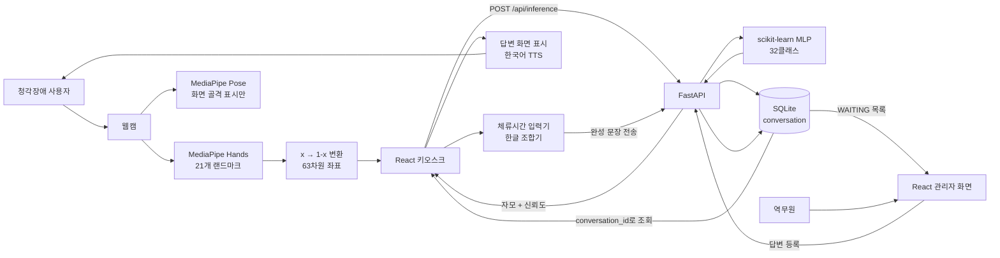
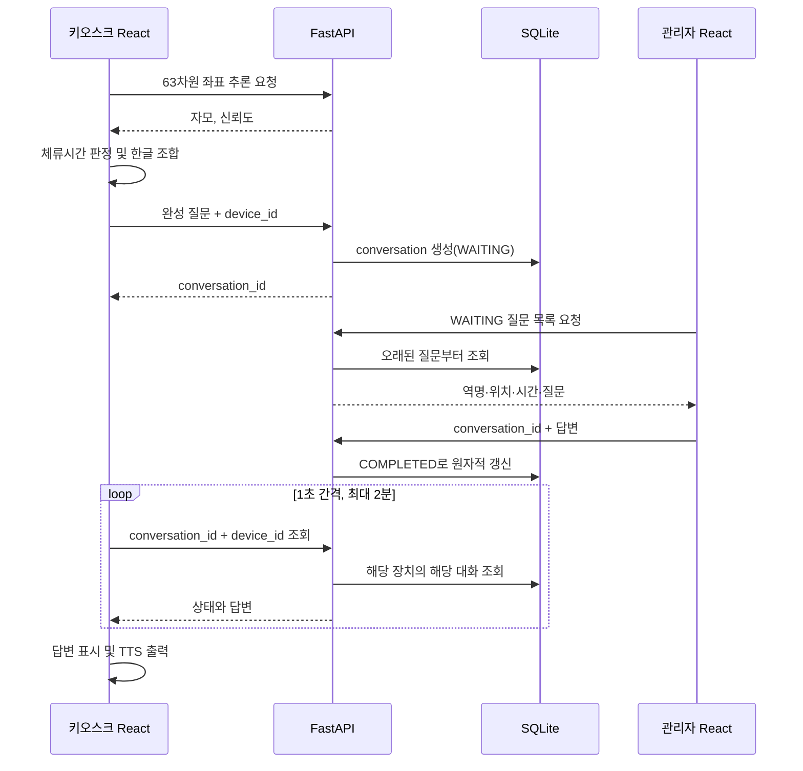
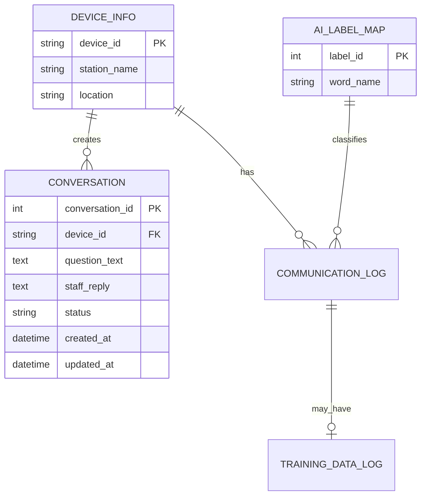

# 최종 발표용 프로젝트 분석

> 분석 기준: 2026-06-21 현재 `feature/device-settings-20260621` 브랜치의 실제 코드, 운영 모델 파일, DB 마이그레이션, 자동 테스트 및 검증 문서  
> 프로젝트명: **청각장애인을 위한 수어 인식 기반 교통 안내 키오스크 시스템**  
> 주의: 이 문서는 일반 수어 번역 시스템이 아니라, 현재 실제 구현된 **정적 한국 수어 지문자 기반 의사소통 키오스크**를 기준으로 작성했다.

---

## [1] 프로젝트 한 줄 소개

### 발표용 한 줄

**웹캠으로 한국 수어 지문자를 인식해 한글 질문을 만들고, 이를 역무원에게 전달하여 화면과 음성으로 답변받는 배리어프리 교통 안내 키오스크입니다.**

### 프로젝트 목적

이 프로젝트의 목적은 교통시설에서 청각장애 사용자가 음성 대화에 의존하지 않고 역무원에게 질문할 수 있는 의사소통 수단을 제공하는 것이다. 사용자는 키오스크의 웹캠 앞에서 한글 지문자를 표현하고, 시스템은 손 모양을 자모로 변환하여 문장을 조합한다. 완성된 질문은 역명과 설치 위치 정보와 함께 역무원 화면으로 전달되며, 역무원이 입력한 답변은 해당 키오스크에만 표시되고 한국어 음성으로도 출력된다.

현재 코드에서 확인되는 해결 대상은 다음과 같다.

- 음성 중심 안내 환경에서 청각장애 사용자가 역무원에게 질문하기 어려운 문제
- 종이나 휴대전화 메모를 준비하고 번갈아 입력해야 하는 필담의 불편
- 별도 앱 설치나 개인 스마트폰 소유를 전제로 하는 방식의 접근 장벽
- 여러 키오스크에서 발생한 질문을 역무원이 장치 위치와 함께 구분해야 하는 운영 문제

### 기존 방식과의 차별점

| 기존 방식 | 한계 | 본 시스템의 차별점 |
|---|---|---|
| 일반 키오스크 | 터치 메뉴와 음성 안내 중심이며, 메뉴에 없는 질문을 역무원에게 전달하기 어려움 | 사용자가 지문자로 자유 문장을 작성해 실제 역무원에게 전달 가능 |
| 종이·메모장 필담 | 필기도구 준비와 화면 교대가 필요하고 대화 기록을 장치별로 관리하기 어려움 | 질문을 DB에 저장하고 `conversation_id`로 답변 상태를 추적 |
| 스마트폰 앱 | 앱 설치, 개인 기기, 네트워크와 사용 숙련도를 전제로 함 | 공공시설에 설치된 웹캠 키오스크에서 별도 개인 앱 없이 사용 가능 |
| 사전 제작 수어 안내 영상 | 미리 준비된 정보만 제공하고 사용자의 개별 질문을 받기 어려움 | 사용자가 직접 문장을 만들어 역무원의 상황별 답변을 받을 수 있음 |

> 확인 범위: 위 비교는 구현된 상호작용 방식에 대한 서비스 설계 비교이다. 실제 청각장애 사용자 집단을 대상으로 기존 방식과 과업 시간·만족도를 비교한 실험은 **확인 필요**다.

---

## [2] 최종 구현 기능 요약

### 사용자 기능

| 기능 | 실제 동작 | 근거 |
|---|---|---|
| 웹캠 실시간 입력 | 브라우저 카메라 영상을 1280×720으로 받아 처리 | `src/User.js`의 MediaPipe `Camera` |
| 한 손 검출 | MediaPipe Hands에서 최대 한 손만 검출 | `maxNumHands: 1` |
| 손 랜드마크 표시 | 검출한 손의 21개 점을 카메라 화면 위에 표시 | Canvas 오버레이 |
| 자세 골격 표시 | MediaPipe Pose 결과를 화면 안내용 골격으로 표시 | `POSE_CONNECTIONS`; AI 분류 입력에는 미사용 |
| 지문자 추론 | 63차원 손 좌표를 `/api/inference`로 보내 자모와 신뢰도 수신 | `src/User.js`, `app/api/kiosk_api.py` |
| 오인식 억제 | 신뢰도 0.80 이상이고 `none`이 아닌 결과만 문자 입력 후보로 사용 | 프론트와 백엔드 모두 0.80 적용 |
| 체류시간 입력 | 같은 자모를 약 1초 유지하면 한 번 입력 | `WordBuilder(dwellSecs=1.0)` |
| 자동 공백 | 조합 중인 글자가 있을 때 무입력 상태를 약 2초 유지하면 공백 입력 | `spaceSecs=2.0` |
| 한글 음절 조합 | 자음·모음을 초성·중성·종성 규칙에 따라 완성형 한글로 조합 | `KoreanComposer` |
| 문장 편집 | 지우기, 공백, 전체 초기화 | 키오스크 버튼 |
| 질문 전송 | 완성 문장을 장치 ID와 함께 서버에 한 건 저장 | `POST /api/conversations` |
| 중복 전송 방지 | 전송 잠금과 답변 대기 상태에서 추가 전송 차단 | `submissionLock`, `isPolling` |
| 답변 상태 확인 | 1초 간격 순차 폴링, 최대 2분 대기 | `createSequentialPoller` |
| 답변 표시·음성 출력 | 역무원 답변을 화면에 표시하고 Web Speech TTS로 한국어 재생 | `speechSynthesis` |
| 재전송 | 마지막 전송 문장을 다시 전송 | 답변 대기 중에는 비활성화 |
| 장치 설정 | 관리자 인증 후 등록 장치를 선택하고 브라우저에 저장 | `DeviceSettingsModal`, `localStorage` |
| 오류 안내 | 카메라 권한 거부, 카메라 없음, AI 미로드, 서버 연결 실패, TTS 실패 등을 화면에 표시 | `src/User.js` |

### 관리자·역무원 기능

| 기능 | 실제 동작 | 근거 |
|---|---|---|
| 관리자 로그인 | 환경설정의 관리자 비밀번호 검증 후 서명된 HttpOnly 세션 쿠키 발급 | `/api/auth/login`, `app/core/auth.py` |
| 세션 확인·로그아웃 | 세션 만료 확인 및 쿠키 제거 | `/api/auth/me`, `/api/auth/logout` |
| 대기 질문 조회 | 답변 대기 질문을 오래된 순서로 조회 | `/api/staff/list` |
| 질문 위치 확인 | 역명, 위치, 장치 ID, 요청 시각, 질문 전체를 표시 | `src/admin/Admin.js` |
| 답변 입력 | 키보드 입력과 Enter 전송 지원 | 관리자 답변 입력창 |
| 음성 답변 입력 | 브라우저 Web Speech Recognition으로 한국어 음성을 텍스트에 반영 | `SpeechRecognition` 또는 `webkitSpeechRecognition` |
| 빈 답변 방지 | 공백 답변을 프론트와 서버 양쪽에서 차단 | `Admin.js`, Pydantic validator |
| 중복 답변 방지 | `WAITING` 상태인 대화만 원자적으로 `COMPLETED` 처리 | `complete_conversation()` |
| 장치 목록·등록·수정 | 인증 후 장치 ID, 역명, 위치 관리 | `/api/devices` |
| 장치 선택 보호 | 장치 선택 후 관리자 세션을 로그아웃하고 선택값 적용 | `selectDeviceSecurely()` |

### 시스템·운영 기능

- SQLite 자동 마이그레이션과 초기 데이터 생성
- 모델과 라벨 인코더 시작 시 1회 로드
- 모델 라벨 순서와 DB `ai_label_map` 자동 비교
- DB와 AI 모델 준비 상태를 확인하는 `/api/health`
- 요청별 `X-Request-ID` 발급과 오류 화면 표시
- 요청 본문 크기 제한, 엔드포인트별 요청 빈도 제한, CORS, 보안 헤더
- 운영 환경에서 HTTPS 리다이렉트 및 비밀번호·세션 비밀값 검증
- SQLite 온라인 백업, 모델 SHA-256 검증 및 배치 스크립트
- React·FastAPI·SQLite·모델·MediaPipe 웹 자산을 포함한 Windows 포터블 EXE
- 카메라·마이크·스피커를 확인하는 `/hardware-check.html`

### 구현됐지만 제한되거나 연결이 불완전한 부분

| 항목 | 상태 |
|---|---|
| `communication_log` | 테이블과 ORM은 존재하지만 현재 `/api/inference` 경로는 자모별 추론 결과를 저장하지 않음. 레거시 보존 구조 |
| `training_data_log` | 테이블은 존재하지만 현재 웹 흐름에서 원시 좌표를 저장하지 않음 |
| `CANCELLED` 상태 | 스키마와 조회·답변 방어 로직은 있으나 사용자가 질문을 취소하는 API·버튼은 확인되지 않음 |
| MediaPipe Pose | 화면 골격 표시에 사용되지만 운영 MLP 모델 입력에는 연결되지 않음 |
| MySQL | 설정과 드라이버 지원은 있으나 현재 검증된 기본 실행 DB는 SQLite |
| Redis | 의존성에 포함되고 다중 worker 시 확장 설명은 있으나 현재 코드에서 실제 사용되지 않음 |
| PyTorch MLP·BiLSTM | 학습 대안·연구 코드로 존재하지만 최종 운영 모델과 웹 추론 경로에서는 사용되지 않음 |
| AI Hub 단어 데이터 | 과거 단어 수어 연구 코드에 존재하지만 최종 지문자 운영 모델 사용 여부는 확인되지 않으며 운영 경로에는 연결되지 않음 |
| 자동 교통정보 조회 | 열차 시간표·운행정보 Open API 연결 코드는 확인되지 않음. 현재 교통 안내 답변 주체는 역무원 |
| 외부 PC 실제 장치 검증 | 포터블 EXE의 로컬 자동 검증은 완료. 다른 PC의 카메라·마이크·스피커 실사용은 확인 필요 |
| 교차 Origin 장치 수정 | 장치 수정은 `PUT` API지만 현재 CORS 허용 메서드는 `GET`, `POST`, `OPTIONS`다. 같은 Origin·개발 프록시에서는 동작하지만 프론트와 API를 다른 Origin으로 분리 배포할 경우 확인·수정 필요 |

### 현재 검증 결과

- React: 9개 테스트 스위트, 29개 테스트 통과
- Python: 9개 테스트 통과
- 합계: **38개 자동 테스트 통과**
- ESLint·Ruff 통과
- React 프로덕션 빌드 통과
- 모델 파일 존재, 63차원 입력과 32클래스 확인

---

## [3] 전체 시스템 흐름

### 사용자 입력 → AI → 서버 → DB → 화면 출력

1. 브라우저가 키오스크의 웹캠 영상을 가져온다.
2. MediaPipe Hands가 한 손의 21개 랜드마크 `(x, y, z)`를 추출한다.
3. 웹 학습 좌표계를 맞추기 위해 각 점의 `x`를 `1-x`로 변환하고 63개 숫자로 펼친다.
4. React가 약 3프레임마다 63차원 좌표를 FastAPI의 `/api/inference`로 전송한다. 코드에는 200ms 최소 간격도 적용돼 있다.
5. FastAPI가 시작할 때 메모리에 올린 scikit-learn MLP 모델로 32개 클래스의 확률을 계산한다.
6. 예측이 `none`이 아니고 신뢰도 0.80 이상이면 자모 후보로 인정한다.
7. React의 체류시간 입력기가 같은 자모를 약 1초 유지했을 때 자모를 확정한다.
8. 한글 조합기가 자음과 모음을 완성형 한글 음절과 문장으로 만든다.
9. 사용자가 전송하면 완성 문장이 `conversation` 테이블에 `WAITING` 상태로 저장되고 `conversation_id`가 반환된다.
10. 관리자 화면은 대기 질문을 주기적으로 조회해 역명·위치·시간·문장을 표시한다.
11. 역무원이 텍스트 또는 음성으로 답변하면 같은 대화 레코드가 `COMPLETED`로 변경된다.
12. 키오스크는 자신이 받은 `conversation_id`와 `device_id`로 답변을 조회한다.
13. 답변이 도착하면 화면에 표시하고 브라우저 TTS로 읽은 뒤 폴링을 종료한다.

### 발표용 구조 설명

“프론트엔드는 카메라 입력과 MediaPipe 좌표 추출, 한글 문장 조합을 담당합니다. 백엔드는 MLP 모델 추론, 질문·답변 API, 관리자 인증과 장치 관리를 담당합니다. SQLite는 장치 정보와 완성된 질문·답변 상태를 저장합니다. 이렇게 영상 원본과 매 프레임 좌표는 DB에 저장하지 않고, 최종 문장만 저장하여 데이터 흐름을 단순화했습니다.”

### Mermaid 시스템 구조도

### 질문·답변 시퀀스

---

## [4] 기술 스택 표

| 구분 | 기술 | 실제 사용 위치 | 발표용 선택 이유 |
|---|---|---|---|
| 언어 | JavaScript | React 화면, 한글 조합, 폴링 | 브라우저에서 카메라와 사용자 인터페이스를 실시간으로 처리하기 위해 사용 |
| 언어 | Python 3.10 | FastAPI, AI 추론, DB·배포 도구 | AI·데이터 처리 생태계와 웹 API 개발을 한 언어에서 연결하기 위해 사용 |
| 프론트엔드 | React 19 | `/`, `/admin`, 장치 설정 | 실시간 상태 변화가 많은 인식 화면과 관리자 목록을 컴포넌트 기반으로 구성 |
| 라우팅 | React Router | 사용자·관리자 경로 분리 | 하나의 프론트 애플리케이션에서 키오스크와 관리자 화면을 분리 |
| HTTP | Axios | 추론, 질문, 폴링, 인증, 장치 API | 타임아웃과 오류 응답을 일관되게 처리 |
| 웹 AI | MediaPipe Hands | 브라우저에서 손 21개 좌표 추출 | 영상 전체 대신 경량 좌표를 사용해 실시간 처리 |
| 화면 안내 | MediaPipe Pose | 카메라 화면 골격 오버레이 | 사용자가 카메라 안에서 자신의 자세를 확인하도록 시각적 피드백 제공 |
| AI 모델 | scikit-learn MLPClassifier | 최종 운영 모델 | 정적 지문자 한 프레임의 63차원 좌표를 빠르게 분류하는 문제에 적합 |
| 모델 저장 | joblib | `gesture_model.pkl`, `label_encoder.pkl` | sklearn 모델과 라벨 변환기를 그대로 저장·복원 |
| 수치 처리 | NumPy | `(1,63)` float32 변환, 확률 처리 | 모델 입력 형태를 검증하고 효율적으로 전달 |
| 백엔드 | FastAPI | REST API, OpenAPI `/docs` | Pydantic 요청 검증과 자동 API 문서, 비동기 웹 서버 구조 제공 |
| 서버 | Uvicorn | FastAPI 실행 | ASGI 기반 FastAPI 애플리케이션 실행 |
| 검증 | Pydantic | 63개 좌표, 장치 ID, 질문·답변 길이 | 잘못된 요청이 서비스 로직에 들어오기 전에 차단 |
| ORM | SQLAlchemy | 테이블 모델과 질의 | SQLite와 MySQL을 같은 ORM 코드로 지원 |
| 마이그레이션 | Alembic | DB 버전 `20260620_01` | 새 PC나 배포 환경에서 동일한 스키마 재현 |
| DB | SQLite | 현재 기본·포터블 DB | 단일 키오스크 PC에서 별도 DB 서버 없이 설치와 백업이 간단 |
| 선택 DB | MySQL + PyMySQL | 환경변수 설정 시 지원 | 중앙 서버 형태로 확장할 수 있도록 코드상 지원하지만 현재 기본 검증 환경은 아님 |
| 음성 입력 | Web Speech Recognition | 관리자 답변 입력 | 별도 STT 서버 없이 브라우저에서 한국어 답변 입력 보조 |
| 음성 출력 | SpeechSynthesis | 사용자 답변 출력 | 화면 답변을 음성으로도 제공 |
| 테스트 | Jest, Testing Library, unittest | React 29개, Python 9개 | UI 상태와 API·DB·모델 계약을 자동 검증 |
| 품질 | ESLint, Ruff | JS·Python 정적 검사 | 문법·품질 문제를 배포 전에 발견 |
| 패키징 | PyInstaller | Windows 포터블 EXE | 외부 PC에서 Python·Node.js 설치 없이 실행 |
| 웹 서버·HTTPS | Caddy 설정 예시 | `deployment/` 및 배포 스크립트 | 실제 HTTPS 배포 준비용이며 현재 현장 배포 여부는 확인 필요 |

### 운영 기술과 연구 기술 구분

- **OpenCV**: Python 데이터 수집·실시간 데모·라이브 평가에 사용한다. 최종 브라우저 키오스크의 영상 처리는 OpenCV가 아니라 MediaPipe JavaScript가 담당한다.
- **PyTorch MLP**: 대안 학습 코드가 있지만 최종 `gesture_model.pkl`은 scikit-learn MLP다.
- **BiLSTM**: `research/word_bilstm/`에 26개 단어 연구 코드가 있으나 운영 백엔드와 React가 import하지 않는다.
- **TensorFlow·CTC**: 현재 운영 코드 및 의존성에서 사용이 확인되지 않는다. 발표에서 사용 기술로 제시하면 안 된다.
- **Node.js**: React 개발·빌드·테스트 도구로 사용한다. 최종 백엔드 서버는 Node.js가 아니라 FastAPI다.
- **LLM·교통 Open API**: 현재 실제 연결 코드가 확인되지 않는다.

---

## [5] AI 수어 인식 과정

### 모델이 수어를 이해하는 과정

발표에서는 “영상 자체를 MLP에 넣는다”고 설명하면 안 된다. 실제 과정은 다음과 같다.

1. 웹캠 영상에서 MediaPipe Hands가 손가락 관절과 손목을 포함한 21개 특징점을 찾는다.
2. 각 특징점은 가로 `x`, 세로 `y`, 깊이 `z` 세 값으로 표현된다.
3. 학습용 Python 영상은 좌우 반전된 프레임을 사용했기 때문에 웹에서는 `x → 1-x`로 좌표계를 맞춘다.
4. 21개 점 × 3개 좌표를 순서대로 펼쳐 63차원 `float32` 벡터로 만든다.
5. MLP가 이 벡터를 `none` 포함 32개 클래스 중 하나로 분류하고 각 클래스 확률을 계산한다.
6. 최고 확률이 0.80 미만이거나 결과가 `none`이면 실제 문자 입력으로 인정하지 않는다.
7. 인정된 같은 자모가 약 1초 유지되면 한 번 입력하고, 한글 조합기가 음절로 결합한다.

### 발표용 쉬운 비유

“카메라 사진 전체를 외우는 방식이 아니라, 손가락 관절 21개의 위치를 숫자 63개로 바꾼 뒤 그 숫자 배열의 모양을 학습한 모델이 어떤 자모인지 판단합니다. 그래서 배경 영상 전체보다 손의 구조에 집중할 수 있습니다.”

### AI 관련 파일의 역할

| 파일 | 역할 |
|---|---|
| `app/ai/models/gesture_model.pkl` | 63차원 좌표를 32개 클래스 ID로 분류하는 운영 MLP 모델 |
| `app/ai/models/label_encoder.pkl` | 모델이 출력한 숫자 ID를 `ㄱ`, `ㅏ`, `none` 같은 실제 라벨로 변환 |
| `app/ai/inference.py` | 모델·인코더 로드, 입력 `(1,63)` 검증, 예측 확률 계산, 0.80 임계값 판정 |
| `src/ai/fingerspellingLandmarks.js` | 브라우저 좌표의 `x`를 반전하고 63개 숫자로 평탄화 |
| `src/User.js` | MediaPipe 실행, 추론 API 호출, 신뢰도 표시와 자모 후보 전달 |
| `src/word_composer/word_builder.js` | 자모 체류시간과 공백 체류시간 제어 |
| `src/word_composer/korean_composer.js` | 자음·모음을 완성형 한글로 조합 |
| `ai/fingerspelling/train_classifier.py` | 운영형 sklearn MLP 후보 모델 학습 코드. 운영 모델 재학습은 현재 정책상 수행하지 않음 |
| `ai/fingerspelling/realtime_inference.py` | OpenCV·Python 기반 모델 단독 실시간 확인 도구 |
| `ai/fingerspelling/evaluate_live.py` | 자모별 실제 카메라 평가와 혼동행렬 저장 도구 |

### 확인된 모델 사양

- 모델 버전: `fingerspelling-mlp-2026.06.19-v2`
- 모델 종류: scikit-learn `MLPClassifier`
- 은닉층: 256 → 128 → 64
- 입력: 63차원
- 출력 클래스: 32개
- 구성: `none` 1개 + 자음 14개 + 모음 17개
- 손 수: 동시에 한 손
- 손 검출 임계값: 0.7
- 추적 임계값: 0.5
- 문자 인정 임계값: 0.80
- `none`: 손이 없는 상태가 아니라 어떤 지문자에도 해당하지 않는 중립 손 자세
- 손이 검출되지 않으면 추론 API를 호출하지 않고 문자 후보를 제거

### 확인된 평가 결과와 해석

| 항목 | 결과 |
|---|---:|
| normal 조건 샘플 | 660개 |
| 전체 평가 정확도 | 96.67% |
| 임계값 이상 인식률 | 89.55% |
| 실제 인식된 결과의 정확도 | 98.14% |
| `none` 정확도 | 100% |
| 자모별 최저 정확도 | 85% (`ㅔ`) |

발표 해석: “모든 입력을 억지로 문자로 출력하지 않고, 불확실한 약 10%는 거부하는 대신 실제로 출력한 결과의 정확도를 98.14%로 높이는 정책을 사용했습니다.”

평가 주의사항:

- `tester01`은 학습 데이터 수집 참여자이므로 독립 평가가 아니다.
- dim·near·far 최종 실사 평가는 완료되지 않았다.
- 데이터 증강은 실제 조명·거리 평가와 동일하지 않다.
- 일반 수어, 연속 동작 단어 수어, 양손 동시 동작을 번역하는 모델이 아니다.

---

## [6] DB/API 구조

### 데이터는 어디에 저장되는가

현재 기본 DB는 프로젝트 또는 포터블 실행 폴더의 SQLite `kiosk.db`다. 서버가 시작될 때 Alembic 마이그레이션을 적용하고 기본 장치 `SEOUL_01`과 모델 라벨 32개를 준비한다. 사용자가 보내는 매 프레임 손 좌표는 저장하지 않으며, 전송 버튼을 눌렀을 때 완성된 질문 한 건만 `conversation` 테이블에 저장한다.

### DB 테이블

| 테이블 | 주요 컬럼 | 역할 | 현재 연결 상태 |
|---|---|---|---|
| `device_info` | `device_id`, `station_name`, `location` | 키오스크 ID와 설치 역·위치 저장 | 질문·관리자 화면·장치 관리에 사용 |
| `ai_label_map` | `label_id`, `word_name`, `description` | 모델 클래스 ID와 자모 매핑 | 서버 시작 시 `label_encoder`와 순서 검증 |
| `conversation` | `conversation_id`, `device_id`, `question_text`, `staff_reply`, `status`, 시각 | 완성 질문과 역무원 답변의 실제 저장 단위 | 현재 핵심 대화 흐름에 사용 |
| `communication_log` | `log_id`, 장치·라벨 FK, 인식 단어, 답변, 상태 | 과거 자모 단위 통신 로그 구조 | 현재 `/api/inference`에서는 저장하지 않음 |
| `training_data_log` | `data_id`, `log_id`, `raw_json_data` | 과거 원시 학습 데이터 저장 구조 | 현재 웹 흐름에서는 사용하지 않음 |
| `alembic_version` | `version_num` | 적용된 DB 마이그레이션 버전 | Alembic이 관리 |

### 핵심 관계

### API 목록

| 방식·경로 | 역할 | 요청 핵심 | 연결 화면 | 인증 |
|---|---|---|---|---|
| `GET /api/health` | DB·AI 준비 상태 확인 | 없음 | 운영 점검 | 없음 |
| `POST /api/inference` | 63차원 좌표로 지문자 추론 | `device_id`, `keypoints[63]` | 키오스크 | 없음 |
| `POST /api/conversations` | 완성 질문 저장 | `device_id`, `question_text` | 키오스크 전송 | 없음 |
| `GET /api/conversations/{id}` | 해당 장치의 질문 상태·답변 조회 | 경로 ID, 쿼리 `device_id` | 키오스크 폴링 | 없음 |
| `POST /api/auth/login` | 관리자 로그인·세션 쿠키 발급 | `password` | 관리자·장치 설정 | 비밀번호 |
| `GET /api/auth/me` | 세션 유효성 확인 | 쿠키 | 관리자·장치 설정 | 세션 |
| `POST /api/auth/logout` | 세션 쿠키 제거 | 없음 | 관리자·장치 설정 | 없음 |
| `GET /api/staff/list` | `WAITING` 질문 페이지 조회 | `page`, `limit` | 관리자 목록 | 세션 |
| `POST /api/staff/reply` | 질문에 답변하고 완료 처리 | `conversation_id`, `reply` | 관리자 답변 | 세션 |
| `GET /api/devices` | 등록 장치 목록 | 없음 | 장치 설정 | 세션 |
| `POST /api/devices` | 새 장치 등록 | ID·역명·위치 | 장치 설정 | 세션 |
| `PUT /api/devices/{id}` | 역명·위치 수정 | 역명·위치 | 장치 설정 | 세션 |

비 API 경로:

- `/`: 개발 모드에서는 서버 상태 JSON, 포터블 `SERVE_FRONTEND=true`에서는 키오스크 React 화면
- `/admin`: React 관리자 화면(SPA fallback)
- `/info`: 앱 이름·환경·모델 로드 여부
- `/docs`: FastAPI OpenAPI 문서
- `/hardware-check.html`: 카메라·마이크·스피커 점검

### 저장·조회 발표 문장

“AI 추론은 실시간성과 개인정보 최소화를 위해 DB에 좌표를 저장하지 않습니다. 사용자가 전송을 확정한 완성 문장만 장치 ID와 함께 저장합니다. 서버가 반환한 고유 `conversation_id`로 답변을 조회하므로, 여러 키오스크의 질문이 서로 섞이지 않습니다.”

---

## [7] 화면별 설명

### 사용자 키오스크 `/`

구성 요소:

- 전체 배경: 좌우 반전된 실시간 카메라 영상
- 오버레이: 손 특징점과 자세 골격
- 현재 인식: 예측 자모와 신뢰도 백분율
- 진행 막대: 같은 자모를 유지한 시간
- 조합 중: 현재 완성 중인 한글 음절
- 완성 문장: 지금까지 만든 질문
- 편집 버튼: 지우기·공백·초기화
- 전송·재전송 버튼
- 장치 ID와 관리자 보호 설정 버튼
- 역무원 답변 표시 영역
- 카메라·서버·AI·음성 오류 안내

발표 자료용 문구:

> “사용자 화면은 카메라 영상 위에 현재 인식 자모, 신뢰도, 입력 진행률과 완성 문장을 동시에 보여줍니다. 손 모양을 약 1초 유지하면 자모가 입력되며, 사용자는 큰 버튼으로 문장을 수정한 뒤 역무원에게 전송할 수 있습니다.”

### 관리자 로그인 `/admin`

- 관리자 비밀번호 입력
- 인증 성공 시 HttpOnly 세션 쿠키 사용
- 로그인 과다 시도에 대한 빈도 제한
- 인증 설정 누락, 비밀번호 오류, 세션 만료 안내

발표 자료용 문구:

> “역무원 화면은 일반 사용자가 질문과 장치 정보를 열람하지 못하도록 관리자 세션 인증으로 보호했습니다.”

### 역무원 대기 질문 화면

- 왼쪽: 대기 질문 수와 질문 카드 목록
- 질문 카드: 역명, 위치, 장치 ID, 질문 미리보기, 요청 시각
- 오른쪽: 선택 질문의 전체 문장
- 하단: 키보드 답변, 음성 입력, 답변 전송
- 전송 성공 시 목록에서 제거
- 백그라운드 또는 유휴 상태에 따라 2초·5초 간격 폴링

발표 자료용 문구:

> “역무원은 어느 역의 어느 위치에서 온 질문인지 확인하고, 키보드나 음성으로 답변할 수 있습니다. 답변은 질문의 고유 ID와 연결되어 해당 키오스크에만 전달됩니다.”

### 장치 설정 화면

- 관리자 인증 후 사용
- 등록된 장치 목록 조회
- 새 장치 ID·역명·위치 등록
- 기존 장치의 역명·위치 수정
- 선택 장치를 `localStorage`에 저장
- 질문 전송 또는 답변 대기 중 변경 차단
- 선택 후 관리자 세션 자동 로그아웃

발표 자료용 문구:

> “동일한 프로그램을 여러 역사나 창구에서 사용할 수 있도록 장치를 등록하고 현재 키오스크의 설치 위치를 선택할 수 있습니다. 장치 변경은 관리자만 가능하도록 보호했습니다.”

### 장치 점검 화면

- 카메라 영상 수신 여부
- 마이크 입력 레벨
- 한국어 TTS 스피커 출력
- HTTPS 보안 컨텍스트 여부

### 확인되는 접근성·UX 요소

- 카메라 화면과 인식 상태를 한 화면에 배치
- 흰 글자·어두운 반투명 패널의 높은 시각 대비
- 주요 버튼을 큰 크기로 배치
- 인식 자모와 신뢰도를 즉시 표시
- 진행 막대로 입력 완료 시점 예측 가능
- 질문과 답변을 큰 텍스트로 표시
- 상태 메시지와 답변 영역에 `aria-live="polite"` 적용
- 음성에만 의존하지 않고 모든 핵심 정보를 화면 텍스트로 제공
- 오류 발생 시 원인과 사용자가 취할 행동을 구체적으로 안내

확인 필요:

- WCAG 또는 한국형 웹 콘텐츠 접근성 지침에 따른 정식 검사
- 실제 청각장애 사용자 대상 과업 완수율·SUS 평가
- 고정 폭 520px 키오스크 패널의 다양한 화면 크기·세로 화면 대응성
- 수어 사용자의 실제 문장 작성 속도와 피로도

---

## [8] 발표 시연 순서

### 시연 전 준비

1. 가능하면 외부 앱의 카메라 사용을 모두 종료한다.
2. 포터블 `SignKiosk.exe` 또는 백엔드·React 개발 서버를 실행한다.
3. `/api/health`에서 DB `connected`, AI `loaded`, 전체 준비 `true`를 확인한다.
4. Chrome 계열 브라우저에서 `/`와 `/admin`을 각각 연다.
5. 카메라·마이크 권한을 미리 허용한다.
6. 장치가 `SEOUL_01` 등 유효한 장치로 설정됐는지 확인한다.
7. 짧고 연습된 질문과 답변을 준비한다.

### 권장 시연 시나리오

#### 1단계: 시스템 준비 상태

행동: `/api/health` 또는 키오스크 초기 화면을 보여준다.

발표 대본:

> “먼저 서버가 데이터베이스와 AI 모델을 정상적으로 불러왔는지 확인할 수 있습니다. 두 구성요소가 모두 준비돼야 키오스크가 정상 동작합니다.”

#### 2단계: 실시간 손 인식

행동: 카메라 앞에 손을 보여 손 점과 현재 인식 자모·신뢰도를 보여준다.

발표 대본:

> “웹캠 영상에서 MediaPipe가 손의 21개 특징점을 추출합니다. 이 좌표 63개를 서버의 MLP 모델로 보내 현재 자모와 신뢰도를 받아옵니다.”

#### 3단계: 자모를 문장으로 조합

행동: 연습한 짧은 질문을 표현한다. 필요하면 지우기·공백 버튼을 한 번 보여준다.

발표 대본:

> “우연한 한 프레임을 바로 입력하지 않고 같은 자모를 약 1초 유지해야 확정됩니다. 확정된 자음과 모음은 한글 조합기가 완성형 음절로 변환합니다.”

#### 4단계: 질문 전송

행동: `전송` 버튼을 누르고 `답변 대기 중` 상태를 보여준다.

발표 대본:

> “전송 버튼을 누르면 완성된 문장 전체가 장치 ID와 함께 DB에 한 건 저장되고, 고유한 대화 ID가 생성됩니다. 답변 대기 중에는 중복 전송을 막습니다.”

#### 5단계: 관리자 질문 확인

행동: `/admin`에서 로그인하고 대기 질문을 선택한다.

발표 대본:

> “역무원 화면에서는 질문 내용뿐 아니라 역명, 설치 위치, 장치 ID와 요청 시각을 함께 확인할 수 있습니다.”

#### 6단계: 답변 입력·전송

행동: 키보드 또는 음성 입력으로 짧은 답변을 작성하고 전송한다.

발표 대본:

> “역무원은 키보드나 브라우저 음성 인식으로 답변을 작성할 수 있습니다. 빈 답변과 이미 완료된 질문에 대한 중복 답변은 서버에서도 차단됩니다.”

#### 7단계: 키오스크 답변 확인

행동: 키오스크에서 답변 텍스트와 TTS 출력을 확인한다.

발표 대본:

> “키오스크는 전송할 때 받은 대화 ID로 자신의 답변만 확인합니다. 답변이 도착하면 화면에 표시하고 한국어 음성으로도 출력한 뒤 폴링을 종료합니다.”

#### 8단계: 장치 관리 강조(시간이 있으면)

행동: 설정 버튼을 열어 장치 목록·역명·위치를 보여주되 시연 중 실제 값은 바꾸지 않는다.

발표 대본:

> “하나의 프로그램을 여러 역과 창구에서 사용할 수 있도록 관리자 보호 장치 등록과 선택 기능도 구현했습니다.”

### 권장 시연 시간

- 준비 상태와 구조: 20초
- 지문자 2~4자 인식: 50초
- 질문 전송과 관리자 확인: 30초
- 답변 전송과 사용자 수신: 30초
- 장치 관리: 20초
- 합계: 약 2분 30초

### 장애별 백업 시나리오

| 문제 | 즉시 대응 | 발표 설명 |
|---|---|---|
| 손 인식이 불안정 | 조명을 정면으로 맞추고 손 전체를 카메라 중앙에 둔 뒤 천천히 표현 | “실제 환경에서는 조명과 거리 영향을 받으므로 신뢰도 임계값으로 불확실한 입력을 거부합니다.” |
| 카메라 권한 실패 | 주소창 카메라 권한 허용 또는 `/hardware-check.html`로 전환 | 오류 안내 화면 자체를 복구 설계로 설명 |
| 긴 문장 시연 지연 | 미리 정한 2~4자 짧은 단어만 직접 인식하고 나머지는 기존 캡처·영상으로 설명 | 실시간 인식 핵심과 전체 질문·답변 흐름을 분리 시연 |
| 관리자 음성 입력 실패 | 키보드로 답변 | 음성 입력은 보조 기능이며 핵심 답변 기능은 유지됨 |
| TTS 소리가 안 남 | 화면 답변을 보여주고 스피커 설정 확인 | 화면 표시가 기본이고 TTS는 보조 출력임을 설명 |
| 백엔드 연결 실패 | `/api/health`, 로그, 준비된 시연 영상·화면 캡처 사용 | 요청 ID와 헬스체크가 운영 장애 분석을 지원함을 설명 |
| 모델 로드 실패 | 모델 SHA-256과 `/info` 화면 캡처 제시 | 모델 무결성 검증과 실패 시 503 처리 설명 |
| 전체 라이브 시연 불가 | ① 구조도 ② 녹화 영상 ③ 관리자 질문 캡처 ④ 테스트 결과 순으로 대체 | 녹화 영상은 실제 동일 빌드에서 사전 촬영했다고 명시 |

---

## [9] 발표용 핵심 문장

### 문제 정의

“교통시설의 안내가 음성과 정해진 터치 메뉴에 집중되면, 청각장애 사용자는 메뉴 밖의 질문을 역무원에게 전달하기 어렵습니다.”

### 목표

“저희는 수어 지문자로 자유 문장을 작성하고, 역무원의 답변을 다시 화면으로 받을 수 있는 배리어프리 의사소통 흐름을 구현했습니다.”

### AI

“영상 전체를 분류하는 대신 손 관절 21개의 위치를 63개 숫자로 바꾸어 MLP가 자모를 판단하도록 했습니다.”

### 신뢰성

“모든 입력을 억지로 문자로 출력하지 않고 신뢰도 0.80 미만을 거부하여, 실제 출력된 결과의 정확성을 우선했습니다.”

### 시스템

“AI 인식에서 끝나지 않고 한글 조합, 질문 저장, 관리자 인증, 답변 전달과 음성 출력까지 실제 서비스 흐름을 연결했습니다.”

### 개인정보 최소화

“카메라 영상과 실시간 손 좌표는 DB에 저장하지 않고, 사용자가 전송을 확정한 완성 문장만 저장합니다.”

### 다중 키오스크

“질문마다 고유 대화 ID를 부여하고 장치 ID를 함께 검증하여 다른 키오스크의 답변이 섞이지 않게 했습니다.”

### 프로젝트 범위

“본 시스템은 일반 연속 수어 번역기가 아니라, 정적 한국 수어 지문자를 이용해 교통 안내 질문을 작성하는 의사소통 키오스크입니다.”

### 결과

“normal 조건 660개에서 전체 정확도 96.67%, 임계값 이상으로 출력된 결과의 정확도 98.14%를 기록했습니다. 다만 독립 평가와 다양한 환경 평가는 후속 과제입니다.”

### 마무리

“기술의 목적은 사람을 완전히 대체하는 것이 아니라, 청각장애 사용자와 현장 역무원 사이의 첫 번째 의사소통 장벽을 낮추는 것입니다.”

---

## [10] 강점

### 기술적 강점

1. **프론트·백엔드·AI·DB의 실제 통합**  
   단순 모델 데모가 아니라 카메라 입력부터 질문·답변 완료까지 연결했다.

2. **학습과 웹 좌표계의 일치**  
   Python은 반전 프레임을 사용하고 웹은 `x → 1-x`로 명시적으로 보정한다.

3. **모델 계약의 명문화**  
   63차원, 32클래스, 라벨 순서, 모델 SHA-256과 임계값을 코드와 테스트로 검증한다.

4. **불확실한 결과 거부**  
   0.80 임계값과 `none` 클래스로 오입력 억제를 우선한다.

5. **대화 무결성**  
   질문별 ID, 장치 ID 검증, 중복 제출 잠금, 원자적 답변 갱신을 적용했다.

6. **운영을 고려한 설계**  
   인증, 속도 제한, 요청 ID, 헬스체크, DB 마이그레이션·백업, 모델 무결성 검증이 있다.

7. **재현 가능한 배포**  
   외부 Windows PC에서 Python·Node.js 없이 실행 가능한 포터블 패키지를 만들었다.

8. **자동 검증**  
   현재 코드에서 38개 자동 테스트와 lint·프로덕션 빌드가 통과한다.

### 서비스적 강점

- 정해진 메뉴가 아닌 자유 문장을 작성할 수 있다.
- 역무원이 실제 현장 상황에 맞게 답변한다.
- 역명과 설치 위치가 함께 전달되어 어느 키오스크의 요청인지 알 수 있다.
- 질문과 답변을 화면에 명확하게 표시한다.
- 사용자가 개인 스마트폰 앱을 설치할 필요가 없다.
- 장치 설정을 통해 여러 역사·창구로 확장할 기반이 있다.

### 사회적 의의

- 교통 정보 접근을 음성 중심에서 시각·수어 기반으로 확장한다.
- 청각장애 사용자가 타인에게 필기도구나 개인 기기를 요청하지 않고 질문을 시작할 수 있게 한다.
- AI를 사람의 대체가 아니라 청각장애 사용자와 역무원 사이의 연결 도구로 사용한다.
- 배리어프리 시스템을 단순 안내 콘텐츠가 아닌 양방향 의사소통 서비스로 구현했다.

### 교수 평가에서 강조할 포인트

- 초기 기획의 큰 범위를 그대로 주장하지 않고 운영 모델 범위를 명확히 정리했다.
- AI 정확도뿐 아니라 데이터 흐름, 보안, 동시성, 배포와 오류 처리를 다뤘다.
- 모델 파일이 잘못 교체되는 문제를 SHA-256과 계약 테스트로 방지한다.
- 레거시 연구 코드와 실제 운영 경로를 분리해 기술 부채를 관리했다.
- 미완료 평가를 숨기지 않고 후속 검증으로 구분했다.

---

## [11] 한계점 및 개선 방향

| 현재 한계 | 영향 | 개선 방향 | 질문 대응 문장 |
|---|---|---|---|
| 정적 지문자만 인식 | 일반 수어 단어·문법을 바로 번역하지 못함 | 독립 사용자 시계열 데이터를 확보한 뒤 운영 지문자 모델과 별도 단어 모델을 단계적으로 연결 | “현재는 정확히 검증 가능한 지문자 입력에 집중했고, 일반 수어 번역은 별도 데이터와 검증이 필요한 후속 범위입니다.” |
| 한 손만 검출 | 양손 동시 수어 불가 | MediaPipe 양손 추적과 양손 좌표 정렬, 양손 클래스 데이터 구축 | “현재 클래스는 자모별 의도된 한 손 표현을 사용하며, 양손 동시는 모델 계약 밖입니다.” |
| 조명·거리·가림 영향 | 손 검출과 분류 성능 저하 가능 | 다양한 카메라·조명 독립 평가, 자동 노출 안내, 손 영역 가이드, 추가 수집 | “불확실한 입력은 0.80 아래에서 거부하고 있으며, 현장 배치 전 조건별 평가가 필요합니다.” |
| 평가자 편향 | 보고된 정확도의 일반화 제한 | 학습 미참여자와 청각장애 사용자를 모집해 자모별·조건별 재평가 | “96.67%는 현재 평가 조건의 결과이며 독립 사용자 전체 성능으로 과장하지 않습니다.” |
| dim·near·far 미평가 | 환경 강건성 합격 판정 불가 | 동일 모델을 유지한 채 조건별 20개 이상 실사 평가와 혼동행렬 기록 | “데이터 증강과 실사 평가는 다르므로 후속 검증 항목으로 남겨두었습니다.” |
| 지문자 입력 속도 | 긴 문장 작성에 시간이 걸리고 피로할 수 있음 | 자주 쓰는 문구, 예측 후보, 단축 입력, 사용자별 체류시간 접근성 설정 | “현재는 정확성 중심의 1초 체류 방식을 사용하며 속도 개선은 사용성 평가 후 진행할 계획입니다.” |
| 자동 교통 데이터 없음 | 열차 시간·운행 상태를 시스템이 자동 답변하지 못함 | 신뢰 가능한 공공 교통 API를 연결하되 출처·갱신 시각·실패 처리 표시 | “현재는 잘못된 자동정보보다 역무원의 확인 답변을 우선했습니다.” |
| 브라우저 STT 의존 | 브라우저·권한·네트워크에 따라 음성 입력 실패 가능 | 키보드를 기본 수단으로 유지하고 필요 시 검증된 로컬 STT 추가 | “음성 입력은 보조 기능이며 실패해도 키보드 답변 흐름은 유지됩니다.” |
| TTS 장치 의존 | 스피커·음성 엔진 문제 가능 | 화면 텍스트를 기본으로 유지하고 장치 점검·재생 실패 안내 강화 | “청각장애 사용자에게는 화면 표시가 핵심이며 TTS는 주변 동반자나 접근성을 위한 보조 출력입니다.” |
| 폴링 방식 | 장치 수가 많아지면 반복 요청 증가 | WebSocket 또는 Server-Sent Events로 이벤트 기반 응답 전환 | “현재 규모에서는 단순하고 복구가 쉬운 순차 폴링을 사용했습니다.” |
| SQLite 단일 worker | 중앙 다중 서버 확장 제한 | 중앙 운영 시 MySQL/PostgreSQL과 Redis 기반 분산 제한기로 전환 | “현재 포터블 단일 PC 목적에는 SQLite가 적합하며 코드상 MySQL 확장 경로를 준비했습니다.” |
| 장치 삭제 없음 | 잘못 만든 장치를 UI에서 삭제할 수 없음 | 대화 FK 보존을 위해 활성·비활성 상태를 추가하는 소프트 삭제 | “기존 대화 무결성을 위해 물리 삭제를 막았고, 향후 비활성화 방식이 적절합니다.” |
| 질문 취소 UI 없음 | 잘못 전송한 질문을 사용자가 취소하지 못함 | `CANCELLED` 상태 전환 API와 사용자 취소 버튼 추가 | “상태는 준비돼 있지만 취소 인터페이스 연결은 확인 필요입니다.” |
| 정식 접근성 평가 미완료 | 실제 사용성 근거 부족 | 청각장애 사용자 참여, SUS·과업 시간·오류율 측정, WCAG 검사 | “배리어프리 목적을 완성하려면 당사자 평가가 필수 후속 단계입니다.” |
| 실제 키오스크 외형·현장 배치 미확인 | 역사 소음·조명·카메라 높이 검증 부족 | 거치대·조명·카메라 높이 표준화 후 현장 파일럿 | “현재는 Windows PC와 웹캠 기반 소프트웨어 MVP이며 현장 하드웨어 검증은 다음 단계입니다.” |
| 포터블 EXE 코드 서명 없음 | SmartScreen 경고 가능 | 배포 인증서로 코드 서명, 설치 패키지·자동 업데이트 구성 | “현재 EXE는 테스트 배포용이며 상용 배포 전 코드 서명이 필요합니다.” |
| 분리 배포 시 CORS의 `PUT` 미허용 | 서로 다른 Origin에서 장치 수정 API가 브라우저에 차단될 수 있음 | `allow_methods`에 `PUT`을 추가하고 실제 HTTPS Origin에서 사전 요청 검증 | “현재 같은 Origin 포터블 구성에서는 동작하며, 프론트·API 분리 배포 전 CORS 정책 보완이 필요합니다.” |

---

## [12] PPT 목차

### 10~15분 기준 권장 구성: 14장

| 슬라이드 | 제목 | 핵심 내용 | 권장 자료 | 시간 |
|---:|---|---|---|---:|
| 1 | 표지 | 프로젝트명, 팀명, 한 줄 소개 | 키오스크 대표 화면 | 20초 |
| 2 | 문제 정의 | 교통시설의 음성·터치 중심 안내, 자유 질문의 어려움 | 사용자 상황 일러스트 또는 문제 흐름 | 50초 |
| 3 | 프로젝트 목표 | 지문자 질문 작성 → 역무원 전달 → 답변 수신 | 3단계 목표 도식 | 40초 |
| 4 | 기존 방식의 한계와 차별점 | 일반 키오스크·필담·앱·안내영상 비교 | 4열 비교표 | 50초 |
| 5 | 최종 시스템 개요 | 사용자 화면, 관리자 화면, 장치 관리 | 실제 화면 캡처 3장 | 50초 |
| 6 | 전체 기술 구조 | React·MediaPipe·FastAPI·MLP·SQLite 연결 | Mermaid 구조도를 이미지로 변환 | 60초 |
| 7 | 주요 기능 | 지문자 입력, 한글 조합, 질문 전송, 답변, 인증·장치 | 아이콘+기능 요약 | 50초 |
| 8 | AI 수어 인식 과정 | 21점 → 63차원 → MLP → 임계값 → 한글 조합 | 손 랜드마크 이미지와 파이프라인 | 70초 |
| 9 | 모델 정책과 평가 | 32클래스, 0.80, 660개 결과, 평가 한계 | 막대그래프·핵심 숫자 4개 | 60초 |
| 10 | DB와 API 흐름 | `device_info`, `conversation`, `conversation_id` | ERD와 시퀀스 축약본 | 50초 |
| 11 | 보안·신뢰성·배포 | 관리자 세션, 중복 방지, 요청 ID, 38 tests, EXE | 테스트 결과와 포터블 패키지 캡처 | 45초 |
| 12 | 실제 시연 | 손 인식 → 문장 → 관리자 답변 → 키오스크 출력 | 라이브 시연, 실패 시 녹화 영상 | 2분 30초 |
| 13 | 결과·강점·사회적 효과 | 실제 양방향 흐름 완성, 배리어프리 의미 | 전후 흐름 또는 사용자 가치 3가지 | 50초 |
| 14 | 한계와 개선·마무리 | 정적 지문자 범위, 독립 평가, 현장 검증, 확장 계획 | 단계별 로드맵 | 50초 |

예상 총 발표 시간: 약 12~13분.

### 슬라이드별 복사 문구

1. **문제 정의**: “교통 안내가 음성과 정해진 메뉴에 집중될수록 청각장애 사용자의 자유로운 질문은 어려워집니다.”
2. **목표**: “수어 지문자 입력부터 역무원 답변까지 하나의 양방향 의사소통 흐름을 구현합니다.”
3. **차별점**: “미리 준비된 안내만 제공하는 것이 아니라 사용자가 직접 문장을 만들어 현장 역무원에게 전달합니다.”
4. **시스템 개요**: “키오스크 React, FastAPI AI·대화 서버, SQLite, 관리자 React로 구성됩니다.”
5. **AI**: “손 21개의 3차원 좌표를 63차원 벡터로 변환해 MLP가 32개 클래스를 분류합니다.”
6. **데이터**: “영상·좌표는 저장하지 않고 사용자가 확정한 완성 질문과 답변만 저장합니다.”
7. **결과**: “자동 테스트 38개와 프로덕션 빌드를 통과했으며 Windows 포터블 실행 파일까지 제작했습니다.”
8. **한계**: “현재는 정적 지문자 입력에 집중하며, 독립 사용자·다양한 환경·현장 배치는 후속 검증입니다.”

---

## [13] 예상 질문과 답변

### 1. 이 시스템은 일반 수어 문장 전체를 번역합니까?

아닙니다. 현재 운영 범위는 한 손으로 표현하는 정적 한국 수어 지문자 31개와 `none`을 분류하는 것입니다. 인식한 자모를 한글 조합기로 문장으로 만드는 구조이며, 연속 동작 일반 수어와 양손 동시 수어는 후속 연구 범위입니다.

### 2. 처음 계획한 BiLSTM 대신 왜 MLP를 사용했습니까?

BiLSTM은 여러 프레임의 연속 동작을 분류할 때 적합합니다. 최종 운영 대상은 단일 시점의 손 모양으로 구분하는 정적 지문자이고 입력도 63차원 고정 벡터이므로 MLP가 문제와 데이터 형태에 더 적합했습니다. BiLSTM 코드는 삭제하지 않고 연구 폴더로 분리했습니다.

### 3. AI 모델은 영상에서 무엇을 봅니까?

영상 픽셀 전체를 직접 입력받지 않습니다. MediaPipe Hands가 손목과 손가락 관절 21개의 `(x,y,z)` 좌표를 찾고, 이를 펼친 63개 숫자를 MLP가 분류합니다.

### 4. 왜 신뢰도 임계값을 0.80으로 설정했습니까?

불확실한 결과가 문장에 들어가는 것을 줄이기 위한 운영 기준입니다. 현재 평가는 임계값 적용 시 실제로 출력된 결과의 정확도가 98.14%였습니다. 대신 일부 입력을 거부하므로 인식률은 89.55%이며, 정확성과 입력 편의 사이의 절충입니다.

### 5. `none`은 손이 없다는 뜻입니까?

아닙니다. `none`은 손은 보이지만 어떤 지문자에도 해당하지 않는 중립 손 자세입니다. 손 자체가 검출되지 않으면 모델을 호출하지 않습니다. 이 두 상태를 구분하여 불필요한 문자 입력을 줄입니다.

### 6. 정확도 96.67%를 모든 사용자에게 적용할 수 있습니까?

그렇게 단정할 수 없습니다. normal 조건 660개에서 얻은 결과이며 평가자가 학습 데이터 수집에 참여했습니다. 따라서 독립 평가가 아니고, 조명·거리 조건과 학습 미참여자 평가는 후속 검증이 필요합니다.

### 7. 왼손과 오른손은 어떻게 처리합니까?

모든 자모를 한쪽 손으로 통일하지 않고 데이터 수집 당시 자모별로 의도한 손을 사용했습니다. 웹에서는 학습 당시 반전 좌표계와 맞추기 위해 `x → 1-x`를 적용합니다. 현재 모델은 동시에 한 손만 검출합니다.

### 8. 왜 매 프레임을 DB에 저장하지 않습니까?

실시간 추론 좌표는 양이 많고 현재 서비스에 영구 보관할 필요가 없습니다. 처리 속도와 데이터 최소화를 위해 추론은 메모리에서만 수행하고, 사용자가 전송을 확정한 완성 문장과 답변만 저장합니다.

### 9. 여러 키오스크에서 답변이 섞이지 않습니까?

질문을 생성할 때 고유 `conversation_id`를 반환하고, 키오스크는 이 ID와 자신의 `device_id`를 모두 사용해 조회합니다. 서버 테스트에서도 서로 다른 두 장치의 질문과 답변 분리가 검증됐습니다.

### 10. 왜 WebSocket이 아니라 폴링을 사용했습니까?

현재 규모에서는 1초 간격의 순차 폴링이 구현과 장애 복구가 단순합니다. 이전 요청이 끝나기 전에 다음 요청을 보내지 않아 중첩도 방지했습니다. 장치 수가 많아지면 WebSocket이나 SSE로 전환할 수 있습니다.

### 11. 교통 안내 정보는 AI가 자동으로 답합니까?

현재는 아닙니다. 사용자의 질문을 역무원에게 전달하고 역무원이 실제 상황을 확인해 답변합니다. 자동 교통 API는 잘못된 정보의 책임과 데이터 갱신을 별도로 검증해야 하므로 후속 확장으로 남겼습니다.

### 12. 관리자 보안은 어떻게 구현했습니까?

관리자 비밀번호를 서버에서 비교하고, 만료 시각과 역할을 포함한 HMAC 서명 세션 토큰을 HttpOnly·SameSite Strict 쿠키로 제공합니다. 운영 환경에서는 Secure 쿠키와 HTTPS, 충분한 비밀번호·세션 비밀값을 요구합니다. 로그인 요청에는 빈도 제한도 적용됩니다.

### 13. SQLite를 선택한 이유와 한계는 무엇입니까?

포터블 단일 PC 키오스크에서는 별도 DB 설치 없이 실행·백업이 가능해 SQLite가 적합합니다. 대신 여러 서버 worker를 동시에 쓰는 중앙 운영에는 한계가 있어 현재 worker를 1개로 제한합니다. 중앙 배포로 확장할 때는 코드상 지원하는 MySQL 같은 서버형 DB로 전환할 수 있습니다.

### 14. 장애가 발생하면 어떻게 확인합니까?

`/api/health`에서 DB와 AI 모델 상태를 확인하고, 모든 응답에 요청 ID를 붙여 로그와 화면 오류를 연결합니다. 카메라·마이크·스피커는 전용 하드웨어 점검 페이지가 있으며, 카메라 권한·장치 없음·서버 중단 등은 사용자에게 구체적인 조치 문구를 표시합니다.

### 15. 이 프로젝트의 가장 큰 성과와 남은 과제는 무엇입니까?

가장 큰 성과는 AI 모델 데모에 그치지 않고 손 입력, 한글 문장 조합, 질문 저장, 관리자 인증, 역무원 답변, 키오스크 출력과 포터블 배포까지 전체 흐름을 완성한 것입니다. 남은 핵심 과제는 학습 미참여자와 청각장애 사용자 평가, 다양한 조명·거리 실사 평가, 실제 역사 하드웨어 배치 검증입니다.

---

## 최종 발표 결론 문장

“저희 프로젝트는 청각장애 사용자가 교통시설에서 질문을 시작할 수 있도록 수어 지문자와 역무원 응답 시스템을 연결했습니다. 아직 일반 수어 전체를 번역하는 시스템은 아니지만, 실제로 실행 가능한 범위를 명확히 정의하고 AI, 웹, DB, 보안과 배포를 통합한 배리어프리 교통 의사소통 프로토타입을 완성했습니다.”

## 발표 전 최종 확인 필요 목록

- 외부 PC에서 포터블 EXE, 카메라, 마이크, 스피커 실제 동작
- 시연 장소의 조명과 카메라 거리
- 발표용 짧은 지문자 질문의 반복 연습
- 관리자 로그인용 실제 비밀번호 준비와 화면 노출 방지
- TTS 음량과 발표장 오디오 출력
- 라이브 시연 녹화 백업본과 핵심 화면 캡처
- 정확도 표에서 독립 평가가 아니라는 주석 표시
- “일반 수어 번역”, “자동 교통정보 제공”, “MySQL 운영”으로 과장된 표현이 없는지 검토
